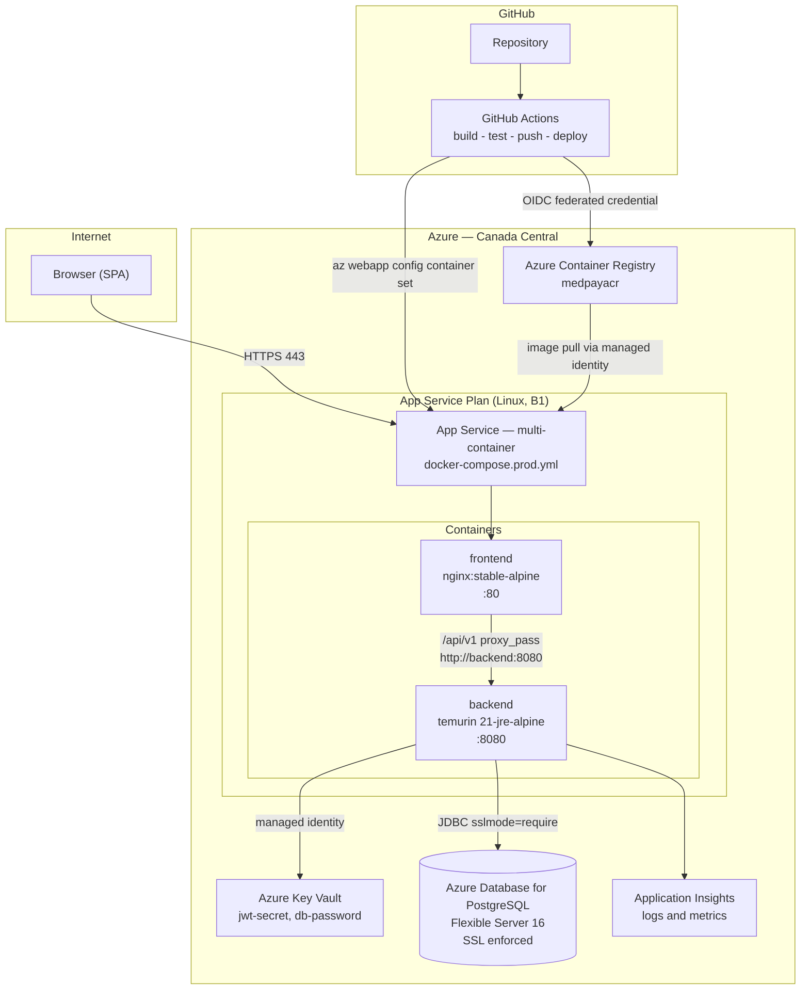

# MedPay Ledger — Product Requirements Document

**A Distributed Medical Claims Processing & Audit Engine**

Version 1.0 · Engineering-ready specification

---

## Project Disclaimer

MedPay Ledger is a reference implementation / portfolio system. It simulates payer-side claims adjudication and provider remittance against an internal double-entry ledger. It does not process real Protected Health Information, does not connect to a clearinghouse or any real payment rail, does not disburse real funds, and is not certified for HIPAA, HITRUST, SOC 2, or any healthcare regulatory regime. All member and provider data is synthetic. Where a production system would require X12 837/835 EDI ingestion and remittance, 270/271 eligibility verification, NPI registry validation, a Business Associate Agreement, or a HIPAA-compliant audit and breach-notification program, this document defines the interface seam where that integration would attach, and marks it explicitly as out of scope.

---

## §0 — Technology Stack & Architecture Decision Record

### 0.1 Locked Stack

| Layer | Technology | Version | Responsible for | Explicitly not doing |
|---|---|---|---|---|
| Language (BE) | Java | 21 | DTOs as `record`, `sealed interface` for adjudication outcomes, pattern-matched `switch` in the state machine | Virtual threads are **not** enabled in v1 — the workload is JDBC-bound and pinned by synchronized Hibernate internals; `spring.threads.virtual.enabled` stays `false` |
| Framework | Spring Boot | 3.3.4 | Autoconfiguration, `@RestController` HTTP layer, `@Transactional` boundaries, Actuator health | No Spring Cloud, no service discovery, no config server |
| Security | Spring Security | 6.3.x | Stateless JWT authentication, `SecurityFilterChain` bean, `@PreAuthorize` method security, BCrypt password hashing | No OAuth2 authorization server, no session store, no CSRF token (stateless, non-cookie) |
| Persistence | Spring Data JPA / Hibernate | 6.5.x | Entity mapping, repository queries, optimistic locking via `@Version`, `@EntityGraph` fetch joins | No native SQL outside Flyway migrations. `ddl-auto` is `validate`, never `update` |
| Migrations | Flyway | 10.17.x | Versioned schema (`V{n}__{name}.sql`), reference-data seeding for `fee_schedules` | No repeatable migrations, no undo migrations, no Flyway callbacks |
| Testing (BE) | JUnit 5.10, MockMvc, Testcontainers 1.20 | — | `@WithMockCustomUser` RBAC tests, controller slice tests, real PostgreSQL 16 integration tests | No H2 — the ledger relies on PostgreSQL `SKIP LOCKED` and partial unique indexes |
| Database | PostgreSQL | 16 | `NUMERIC(19,4)` money, `TIMESTAMPTZ` timestamps, partial unique indexes, `SELECT … FOR UPDATE SKIP LOCKED` | No stored procedures, no triggers, no logical replication |
| Frontend | React + TypeScript | 18.3 / 5.5 | SPA rendering, role-aware routing, claim submission forms, review queue, audit views | No SSR, no SSG, no server components. `strict: true`; the `any` type is banned by ESLint |
| Build | Vite | 5.4 | Dev server with `/api/v1` proxy, production static bundle | No Webpack, no Next.js |
| Styling | Tailwind CSS + Lucide React | 3.4 / 0.44x | Utility-first styling, icon set | No CSS-in-JS, no component library, no Tailwind v4 `@theme` syntax |
| HTTP | Axios | 1.7 | JWT request interceptor, 401 response interceptor | No React Query, no SWR — server state lives in React Context |
| Testing (FE) | Playwright | 1.47 | Route protection, JWT persistence, token expiry, cross-role end-to-end flow | No Jest, no Vitest, no React Testing Library in v1 |
| Gateway | Nginx | `stable-alpine` | Static asset serving, `/api/v1` reverse proxy, SPA history fallback, security headers | No TLS termination (Azure App Service terminates TLS), no rate limiting in v1 |
| Containers | Docker multi-stage + Compose | — | Reproducible build and runtime images, local orchestration | No Kubernetes, no Helm |
| Cloud | Azure ACR, Azure Database for PostgreSQL Flexible Server, Azure App Service (Linux Containers) | — | Image registry, managed PostgreSQL with SSL enforced, container hosting with managed identity | No AKS, no Azure Front Door, no Azure Service Bus |
| CI/CD | GitHub Actions | — | Build → test → coverage gate → ACR push → App Service deploy | No manual deployment steps, no Azure DevOps |

### 0.2 Architecture Decision Records

**ADR-001 — Stateless JWT over server sessions**
*Context.* The API is consumed by a Vite-built SPA served from a separate Nginx container, and the backend runs as a Linux container on App Service that may be recycled at any time.
*Decision.* Authentication issues an HS256-signed JWT with a 60-minute TTL. `SessionCreationPolicy.STATELESS` is set on the `SecurityFilterChain`. No `HttpSession` is ever created.
*Consequence.* Horizontal scale requires no sticky sessions and no distributed session store. The cost is that a token cannot be revoked before expiry — there is no denylist in v1. A compromised token is valid for at most 60 minutes. Recorded as an accepted risk in §8 (NFR-004).

**ADR-002 — `NUMERIC(19,4)` and `BigDecimal` over floating point**
*Context.* Billed, allowed, paid, and patient-responsibility amounts must satisfy exact-cent invariants (`allowed + patient_responsibility = billed`, `sum(lines) = header`).
*Decision.* Every monetary column is `NUMERIC(19,4)`. Every monetary Java field is `java.math.BigDecimal`. Every computed amount is normalized with `setScale(2, RoundingMode.HALF_UP)`. Comparison uses `compareTo`, never `equals`.
*Consequence.* Binary floating-point representation error is structurally impossible. `BigDecimal.equals` is a latent bug (it compares scale), so a static-analysis rule and a code-review checklist item forbid it on money. Arithmetic is slower than primitives — irrelevant at this volume.

**ADR-003 — Flyway over Hibernate `ddl-auto`**
*Context.* The schema carries constraints Hibernate cannot express: a partial unique index on active claim fingerprints, a check constraint enforcing debit/credit sign discipline, and seeded reference data.
*Decision.* All schema changes are versioned SQL under `src/main/resources/db/migration`. `spring.jpa.hibernate.ddl-auto=validate` in every profile including tests.
*Consequence.* The entity model and the schema are verified to agree at boot; a drift fails startup rather than silently corrupting data. Every schema change costs a migration file. Testcontainers runs the real migration chain, so migrations are tested on every build.

**ADR-004 — Append-only ledger with reversing entries over mutable balances**
*Context.* The auditability requirement is that any historical payment position is reconstructable, and that no actor can rewrite history.
*Decision.* `ledger_journals` accepts `INSERT` only. The application grants no `UPDATE` or `DELETE` on that table to the runtime database role. A recoupment is a new balanced pair in a new journal group carrying `reverses_journal_group_id`.
*Consequence.* The ledger is the system of record and is provably immutable at the database-permission layer, not merely by convention. Current balances must be derived by aggregation or maintained as a denormalized column on `provider_accounts` — this system does the latter and reconciles it against the journal sum in a test (§6). Storage grows monotonically.

**ADR-005 — In-process adjudication with a transactional outbox over an external broker**
*Context.* Downstream remittance notification must not be lost if the process dies after the ledger commits, but a portfolio deployment cannot justify the cost and operational surface of Service Bus or Kafka.
*Decision.* Adjudication runs synchronously inside the request transaction. An `outbox_events` row is written in that same transaction. `OutboxDispatcher` polls with `@Scheduled(fixedDelay = 5000)` using `SELECT … FOR UPDATE SKIP LOCKED`.
*Consequence.* The ledger post and the event record are atomic — a dual-write inconsistency is impossible. Delivery is at-least-once, so every sink must be idempotent. Latency between commit and dispatch is up to 5 seconds. The dispatcher is the declared seam where an X12 835 generator or provider webhook attaches.

**ADR-006 — Nginx gateway over browser-originated CORS**
*Context.* The SPA and the API are separate containers. Cross-origin calls from the browser would require a CORS preflight on every mutating request and an allowlist that changes per environment.
*Decision.* Nginx serves the static bundle and reverse-proxies `/api/v1` to the backend. The browser sees one origin.
*Consequence.* No preflight round trip, no `Access-Control-Allow-Origin` configuration in production, and no origin allowlist to maintain. A permissive `CorsConfigurationSource` exists only under the `dev` profile for the Vite dev server on `localhost:5173`. The gateway becomes a single point of failure (§8, NFR-014).

**ADR-007 — Azure App Service over AKS**
*Context.* The system is two containers and a managed database, deployed for demonstration and expected to stay reachable for the duration of a job search.
*Decision.* Azure App Service for Linux Containers, multi-container via `docker-compose.prod.yml`, images from Azure Container Registry, database on Azure Database for PostgreSQL Flexible Server with SSL enforced.
*Consequence.* No cluster to operate, no node upgrades, no ingress controller. Deployment is an image tag change. The ceiling is a single App Service plan instance — vertical scale only, and a documented SPOF. Cost is governed by a budget alert rather than by scale-to-zero, so demo latency stays predictable.

**ADR-008 — `sessionStorage` JWT over httpOnly cookie**
*Context.* The token must survive a page reload but must not be transmissible by a cross-site request.
*Decision.* The token is held in React Context and mirrored to `sessionStorage`. Axios attaches it via an explicit `Authorization: Bearer` request interceptor.
*Consequence.* CSRF is structurally impossible — the browser never attaches the credential automatically, so no CSRF token is needed anywhere in the system. The token is readable by any script executing on the origin, so XSS becomes a credential-theft vector; the mitigation is a strict `Content-Security-Policy` header from Nginx and React's default JSX escaping. This trade is stated plainly rather than presented as a best practice: an httpOnly cookie inverts exactly this pair of risks and would require CSRF defence in return.

### Stack Implementation Notes

| Artifact | Path |
|---|---|
| `pom.xml` (Spring Boot 3.3.4 parent, Java 21 toolchain) | `backend/pom.xml` |
| `MedPayLedgerApplication.java` (`@SpringBootApplication`, `@EnableScheduling`) | `backend/src/main/java/com/medpay/ledger/MedPayLedgerApplication.java` |
| `application.yml`, `application-dev.yml`, `application-demo.yml`, `application-prod.yml` | `backend/src/main/resources/` |
| `package.json` (React 18.3, TS 5.5, Vite 5.4, Tailwind 3.4, Axios 1.7) | `frontend/package.json` |
| `vite.config.ts` (dev proxy `/api/v1` → `http://localhost:8080`) | `frontend/vite.config.ts` |
| `tsconfig.json` (`strict: true`, `noUncheckedIndexedAccess: true`) | `frontend/tsconfig.json` |

---

## §1 — Executive Summary & Business Value

MedPay Ledger receives synthetic professional medical claims from a claims processor, validates them against a contracted fee schedule, and routes them through a deterministic adjudication engine. Claims below a fixed dollar threshold adjudicate and post to an internal double-entry ledger in the same database transaction that accepts them. Claims at or above the threshold hold in a clinical review queue with zero ledger impact until a medical reviewer — who cannot be the submitter — approves or denies them. Every payment position, past and present, is reconstructable from an append-only journal. Reversals are compensating entries, never edits.

The problem this addresses is specific. In manually adjudicated high-cost claim workflows, three failures compound: the approval decision is made by a single actor with no enforced separation from submission; the adjudication arithmetic is performed in spreadsheets where floating-point drift and inconsistent rounding produce cent-level discrepancies that reconcile only by adjustment entries; and the payment history is mutable, so the state of the books at a past date cannot be reproduced under audit. The result is a payment ledger that cannot be defended.

### Value Delivered

| Risk removed | Control added | Evidence produced |
|---|---|---|
| A processor approves a high-cost claim they submitted themselves | `ReviewService` compares `claim.submittedByUserId` against the authenticated principal and throws `SelfApprovalException` (409) before any state transition, independent of the roles the principal holds | `ReviewControllerTest#approve_ownSubmission_returns409` (TC-R-004); the rejection is recorded in `outbox_events` |
| Cent-level drift between claim header, claim lines, and posted journal amounts | `NUMERIC(19,4)` storage, `BigDecimal` arithmetic with `HALF_UP` at scale 2, and a 422-enforced invariant `sum(claim_lines.billed_amount) = claims.billed_amount` | Boundary test matrix in §6 including an off-by-one-cent line sum; `LedgerInvariantTest` asserts every journal group sums to zero |
| Payment history rewritten to conceal an error | `ledger_journals` is `INSERT`-only at the database-role level; recoupments post as a new journal group linked by `reverses_journal_group_id` | `GET /api/v1/audit/claims/{uuid}` returns the complete ordered journal history including reversals; `LedgerAppendOnlyTest` asserts `UPDATE` and `DELETE` are denied |
| Silent loss of a remittance notification after the money is booked | `outbox_events` written in the adjudication transaction; `OutboxDispatcher` polls with `SKIP LOCKED` and at-least-once delivery | Outbox rows carry `published_at`; an unpublished row older than the alert window is an operational signal |
| Duplicate payment for the same service encounter | Deterministic `claim_fingerprint` over provider NPI, member reference, service date, and sorted service codes, enforced by a partial unique index over non-terminal claims | `ClaimSubmissionIT#duplicateFingerprint_returns409` (TC-C-006) returns the pre-existing claim UUID |
| Adjudication decision made without an accountable actor and timestamp | Every state transition writes `reviewed_by_user_id` / `adjudicated_at` and emits an outbox event | Auditor-visible claim history endpoint reconstructs the full lifecycle from `RECEIVED` to terminal state |

### Stack Implementation Notes

| Artifact | Path |
|---|---|
| `AdjudicationService.java` | `backend/src/main/java/com/medpay/ledger/adjudication/AdjudicationService.java` |
| `LedgerPostingService.java` | `backend/src/main/java/com/medpay/ledger/ledger/LedgerPostingService.java` |
| `ReviewService.java` | `backend/src/main/java/com/medpay/ledger/review/ReviewService.java` |
| `OutboxDispatcher.java` | `backend/src/main/java/com/medpay/ledger/outbox/OutboxDispatcher.java` |

---

## §2 — Personas & RBAC Authorization Matrix

### 2.1 Personas

**CLAIMS_PROCESSOR — Dana, intake operations.** Submits professional claims on behalf of contracted providers and triggers adjudication. Dana's claims under $25,000.00 adjudicate and post to the ledger before the HTTP response returns. Her claims at or above $25,000.00 return `202` with status `FLAGGED_REVIEW` and produce no ledger rows. Dana can list and read only the claims she submitted. She cannot approve anything, cannot reverse anything, and cannot read the ledger.

**MEDICAL_REVIEWER — Marcus, clinical review.** Sees the queue of `FLAGGED_REVIEW` claims and nothing else. Approves — which posts the balanced ledger pair and moves the claim to `PAID` — or denies with a reason. Marcus is the only role that may reverse a `PAID` claim. He cannot submit claims. If Marcus also holds `CLAIMS_PROCESSOR`, he still cannot approve a claim whose `submitted_by_user_id` is his own.

**AUDITOR — Priya, internal audit.** Read-only across every ledger journal line and the full lifecycle history of any claim UUID. Priya has no write access to any endpoint in the system. She can see claims she did not submit and did not review — this is deliberate and is the only cross-tenant read in the system.

### 2.2 Authorization Matrix

`ALLOW` means the request reaches the handler. `403` means Spring Security rejects it before or at the handler. `401` applies to any request without a valid bearer token on a non-public endpoint.

| Method | Endpoint | CLAIMS_PROCESSOR | MEDICAL_REVIEWER | AUDITOR |
|---|---|---|---|---|
| POST | `/api/v1/auth/login` | ALLOW (public) | ALLOW (public) | ALLOW (public) |
| GET | `/api/v1/auth/me` | ALLOW | ALLOW | ALLOW |
| GET | `/api/v1/fee-schedules` | ALLOW | 403 | 403 |
| POST | `/api/v1/claims` | ALLOW | 403 | 403 |
| GET | `/api/v1/claims` | ALLOW (own only) | 403 | 403 |
| GET | `/api/v1/claims/{claimUuid}` | ALLOW (own only) | 403 | 403 |
| POST | `/api/v1/claims/{claimUuid}/reversals` | 403 | ALLOW | 403 |
| GET | `/api/v1/review/queue` | 403 | ALLOW | 403 |
| GET | `/api/v1/review/claims/{claimUuid}` | 403 | ALLOW | 403 |
| POST | `/api/v1/review/claims/{claimUuid}/approve` | 403 | ALLOW (not own submission) | 403 |
| POST | `/api/v1/review/claims/{claimUuid}/deny` | 403 | ALLOW (not own submission) | 403 |
| GET | `/api/v1/audit/journals` | 403 | 403 | ALLOW |
| GET | `/api/v1/audit/claims/{claimUuid}` | 403 | 403 | ALLOW |
| GET | `/actuator/health` | ALLOW (public) | ALLOW (public) | ALLOW (public) |

### 2.3 Enforcement Points

Authorization is enforced at three distinct layers, and the layer is chosen deliberately per rule.

**Layer 1 — `SecurityFilterChain` (coarse path matching).** `SecurityConfig` permits `/api/v1/auth/login` and `/actuator/health` and requires authentication on everything else with `anyRequest().authenticated()`. It does not encode role rules; path-to-role mapping lives with the handler so that it cannot drift from the controller.

**Layer 2 — `@PreAuthorize` on controller methods (role rules).** Every rule in the matrix above is a `@PreAuthorize("hasRole('…')")` annotation on the handler, evaluated by the `MethodSecurityInterceptor` registered by `@EnableMethodSecurity(prePostEnabled = true)`. A `403` in the matrix is produced here, converted to the standard error envelope by `GlobalExceptionHandler`'s `AccessDeniedException` handler.

**Layer 3 — service-layer guard (identity and ownership rules).** Two rules cannot be expressed as role checks and are enforced in the service layer against the authenticated principal:

- **Ownership scoping.** `ClaimQueryService` derives `userId` from `SecurityContextHolder` and passes it as a mandatory repository parameter — `findByClaimUuidAndSubmittedByUserId`. A processor requesting another processor's claim UUID receives `404`, not `403`; the existence of the claim is not disclosed.
- **Self-approval block.** `ReviewService#approve` and `#deny` load the claim, compare `claim.getSubmittedByUserId()` to the principal's user UUID, and throw `SelfApprovalException` → `409 SELF_APPROVAL_FORBIDDEN` before evaluating the state machine. This check is on **submitter identity, not role**, which is why it holds for a user granted both `CLAIMS_PROCESSOR` and `MEDICAL_REVIEWER`.

**Can `CLAIMS_PROCESSOR` approve their own flagged high-cost claim? No.** Two independent barriers stand in the way, and either alone is sufficient. First, `POST /api/v1/review/claims/{claimUuid}/approve` carries `@PreAuthorize("hasRole('MEDICAL_REVIEWER')")`, so a principal holding only `CLAIMS_PROCESSOR` is rejected with `403` by the `MethodSecurityInterceptor` before the handler executes. Second, if an administrator grants that same user `MEDICAL_REVIEWER` — clearing barrier one — `ReviewService#approve` still rejects with `409 SELF_APPROVAL_FORBIDDEN` because `submitted_by_user_id` equals the principal. Separation of duties is therefore a property of the data, not of the role grant.

**No role can escalate to another.** Roles are read exclusively from the `roles` claim of the validated JWT, which is populated at login from the `user_roles` join table and signed with the server-side HS256 key. There is no endpoint in the system that creates, modifies, or grants a role — `user_roles` is populated only by Flyway migration `V3__seed_users_and_roles.sql` and by the `@Profile("demo")` seeder. A tampered token fails signature validation in `JwtAuthenticationFilter` and yields `401`. There is no impersonation endpoint, no `X-On-Behalf-Of` header, and no admin API surface.

### Stack Implementation Notes

| Artifact | Path |
|---|---|
| `SecurityConfig.java` (`SecurityFilterChain`, `@EnableMethodSecurity`, `BCryptPasswordEncoder` bean) | `backend/src/main/java/com/medpay/ledger/security/SecurityConfig.java` |
| `JwtAuthenticationFilter.java` (`OncePerRequestFilter`) | `backend/src/main/java/com/medpay/ledger/security/JwtAuthenticationFilter.java` |
| `JwtTokenProvider.java` | `backend/src/main/java/com/medpay/ledger/security/JwtTokenProvider.java` |
| `AuthenticatedUser.java` (`UserDetails` implementation carrying `userUuid`) | `backend/src/main/java/com/medpay/ledger/security/AuthenticatedUser.java` |
| `SelfApprovalException.java` | `backend/src/main/java/com/medpay/ledger/review/SelfApprovalException.java` |
| `V3__seed_users_and_roles.sql` | `backend/src/main/resources/db/migration/V3__seed_users_and_roles.sql` |

---

## §3 — Functional Requirements & Business Rules

### 3.1 Authentication (FR-001 – FR-005)

**FR-001 — Credential exchange.** `POST /api/v1/auth/login` accepts `LoginRequest(String email, String password)`. `AuthService` loads the user by email via `UserRepository#findByEmailIgnoreCase`, verifies the password with `BCryptPasswordEncoder#matches` (strength 12), and on success returns `LoginResponse`. On failure — unknown email or wrong password — it throws `BadCredentialsException`, which `GlobalExceptionHandler` maps to `401 INVALID_CREDENTIALS` with an identical message and response time characteristic for both causes; BCrypt is executed against a dummy hash when the email is unknown so that response timing does not disclose account existence.

**FR-002 — Token structure.** `JwtTokenProvider#issue` produces a compact JWS using `io.jsonwebtoken:jjwt-api:0.12.6` with `Jwts.builder()`.

| Claim | Value | Notes |
|---|---|---|
| `sub` | User UUID (string) | Never the email — the email is mutable, the UUID is not |
| `roles` | `["CLAIMS_PROCESSOR"]` | Array of role names without the `ROLE_` prefix; the prefix is re-applied when building `SimpleGrantedAuthority` |
| `email` | User email | Convenience for the SPA header; not authoritative for authorization |
| `iat` | Issue time (epoch seconds) | |
| `exp` | `iat + 3600` | 60-minute TTL, no refresh token in v1 |
| `jti` | Random UUID | Present for future revocation support; not currently checked |

Signing is **HS256** over a 256-bit secret supplied by `medpay.jwt.secret`. In `prod` the value is an Azure Key Vault reference resolved by App Service; in `dev` it is read from `.env`. `JwtTokenProvider` asserts at construction that the decoded secret is at least 32 bytes and fails fast with `IllegalStateException` otherwise — a short key would cause jjwt to throw at first issuance rather than at boot.

**FR-003 — Filter chain ordering.** `JwtAuthenticationFilter extends OncePerRequestFilter` is registered with `http.addFilterBefore(jwtAuthenticationFilter, UsernamePasswordAuthenticationFilter.class)`. It reads the `Authorization` header, requires the `Bearer ` prefix, parses and validates the signature and expiry, constructs an `AuthenticatedUser`, and sets a `UsernamePasswordAuthenticationToken` on the `SecurityContextHolder`. A malformed, expired, or badly signed token clears the context and lets the chain proceed; the request then fails at `anyRequest().authenticated()` and is rendered as `401` by `RestAuthenticationEntryPoint`. The filter never writes a response body itself.

```java
package com.medpay.ledger.security;

import jakarta.servlet.FilterChain;
import jakarta.servlet.ServletException;
import jakarta.servlet.http.HttpServletRequest;
import jakarta.servlet.http.HttpServletResponse;
import org.springframework.lang.NonNull;
import org.springframework.security.authentication.UsernamePasswordAuthenticationToken;
import org.springframework.security.core.context.SecurityContextHolder;
import org.springframework.security.web.authentication.WebAuthenticationDetailsSource;
import org.springframework.stereotype.Component;
import org.springframework.web.filter.OncePerRequestFilter;

import java.io.IOException;

@Component
public class JwtAuthenticationFilter extends OncePerRequestFilter {

    private static final String BEARER_PREFIX = "Bearer ";

    private final JwtTokenProvider tokenProvider;

    public JwtAuthenticationFilter(JwtTokenProvider tokenProvider) {
        this.tokenProvider = tokenProvider;
    }

    @Override
    protected void doFilterInternal(@NonNull HttpServletRequest request,
                                    @NonNull HttpServletResponse response,
                                    @NonNull FilterChain filterChain)
            throws ServletException, IOException {

        String header = request.getHeader("Authorization");
        if (header != null && header.startsWith(BEARER_PREFIX)) {
            String token = header.substring(BEARER_PREFIX.length());
            tokenProvider.parse(token).ifPresent(principal -> {
                var authentication = new UsernamePasswordAuthenticationToken(
                        principal, null, principal.getAuthorities());
                authentication.setDetails(
                        new WebAuthenticationDetailsSource().buildDetails(request));
                SecurityContextHolder.getContext().setAuthentication(authentication);
            });
        }
        filterChain.doFilter(request, response);
    }
}
```

**Version-sensitive.** `WebSecurityConfigurerAdapter` was removed in Spring Security 6; configuration is a `SecurityFilterChain` `@Bean`. `authorizeRequests()` and `antMatchers()` are also removed — use `authorizeHttpRequests()` and `requestMatchers()`. All servlet imports are `jakarta.*`, not `javax.*`, under Spring Boot 3.

```java
package com.medpay.ledger.security;

import org.springframework.context.annotation.Bean;
import org.springframework.context.annotation.Configuration;
import org.springframework.http.HttpMethod;
import org.springframework.security.config.annotation.method.configuration.EnableMethodSecurity;
import org.springframework.security.config.annotation.web.builders.HttpSecurity;
import org.springframework.security.config.http.SessionCreationPolicy;
import org.springframework.security.crypto.bcrypt.BCryptPasswordEncoder;
import org.springframework.security.crypto.password.PasswordEncoder;
import org.springframework.security.web.SecurityFilterChain;
import org.springframework.security.web.authentication.UsernamePasswordAuthenticationFilter;

@Configuration
@EnableMethodSecurity(prePostEnabled = true)
public class SecurityConfig {

    private final JwtAuthenticationFilter jwtAuthenticationFilter;
    private final RestAuthenticationEntryPoint authenticationEntryPoint;
    private final RestAccessDeniedHandler accessDeniedHandler;

    public SecurityConfig(JwtAuthenticationFilter jwtAuthenticationFilter,
                          RestAuthenticationEntryPoint authenticationEntryPoint,
                          RestAccessDeniedHandler accessDeniedHandler) {
        this.jwtAuthenticationFilter = jwtAuthenticationFilter;
        this.authenticationEntryPoint = authenticationEntryPoint;
        this.accessDeniedHandler = accessDeniedHandler;
    }

    @Bean
    public SecurityFilterChain filterChain(HttpSecurity http) throws Exception {
        return http
                .csrf(csrf -> csrf.disable())
                .cors(cors -> {})
                .sessionManagement(sm -> sm.sessionCreationPolicy(SessionCreationPolicy.STATELESS))
                .authorizeHttpRequests(auth -> auth
                        .requestMatchers(HttpMethod.POST, "/api/v1/auth/login").permitAll()
                        .requestMatchers(HttpMethod.GET, "/actuator/health").permitAll()
                        .anyRequest().authenticated())
                .exceptionHandling(ex -> ex
                        .authenticationEntryPoint(authenticationEntryPoint)
                        .accessDeniedHandler(accessDeniedHandler))
                .addFilterBefore(jwtAuthenticationFilter, UsernamePasswordAuthenticationFilter.class)
                .build();
    }

    @Bean
    public PasswordEncoder passwordEncoder() {
        return new BCryptPasswordEncoder(12);
    }
}
```

CSRF is disabled and this is safe **because** of ADR-008: the credential lives in `sessionStorage` and is attached only by an explicit Axios interceptor, so a cross-site request carries no credential. Disabling CSRF while using cookie-based auth would be a vulnerability; disabling it here is the correct consequence of the storage decision.

**FR-004 — Principal introspection.** `GET /api/v1/auth/me` returns `UserProfileResponse(UUID userUuid, String email, String fullName, List<String> roles)` built from the `SecurityContextHolder` principal without a database read. The SPA calls this on mount to rehydrate role-aware navigation after a reload.

**FR-005 — Client-side token storage.** The SPA stores the raw JWT in `sessionStorage` under key `medpay.jwt` and mirrors decoded claims into `AuthContext`. `sessionStorage` rather than `localStorage` scopes the credential to the browser tab and clears it on tab close. The trade-off is stated in ADR-008 and is not re-litigated: CSRF-immune, XSS-readable.

### 3.2 Claim Intake & Validation (FR-006 – FR-010)

**FR-006 — Submission payload and Bean Validation.** `POST /api/v1/claims` accepts `ClaimSubmissionRequest`, validated by `@Valid` and the Jakarta Bean Validation provider (`hibernate-validator` 8.x). Constraint violations produce `400` with a field-error array (§5.6).

| Field | Constraint | Rejection |
|---|---|---|
| `providerNpi` | `@Pattern(regexp = "^\\d{10}$")` | Non-10-digit NPI |
| `memberReference` | `@NotBlank @Size(max = 64)` | Blank or oversized opaque member key |
| `serviceDate` | `@NotNull @PastOrPresent` | Future service date |
| `billedAmount` | `@NotNull @DecimalMin("0.01") @Digits(integer = 15, fraction = 2)` | Zero, negative, more than two decimals, or 19-digit overflow |
| `lines` | `@NotEmpty @Size(max = 20) @Valid` | Empty or over 20 lines |
| `lines[].serviceCode` | `@NotBlank @Pattern(regexp = "^[A-Z0-9]{5}$")` | Malformed CPT/HCPCS-shaped code |
| `lines[].diagnosisCode` | `@NotBlank @Size(max = 8)` | Malformed ICD-shaped code |
| `lines[].billedAmount` | `@NotNull @DecimalMin("0.01") @Digits(integer = 15, fraction = 2)` | As above |

`@Digits(integer = 15, fraction = 2)` is the guard against the 19-digit overflow case in §6: `NUMERIC(19,4)` holds 15 integer digits, so a 16-digit integer part is rejected at `400` rather than reaching PostgreSQL and producing a `22003` numeric-overflow `500`.

**FR-007 — Idempotency.** `POST /api/v1/claims` requires a `Idempotency-Key` header containing a UUID; a missing or malformed header is `400 MISSING_IDEMPOTENCY_KEY`. `ClaimSubmissionService` persists the key on `claims.idempotency_key` under a unique constraint scoped to `(submitted_by_user_id, idempotency_key)`. On a replayed key, the constraint violation is caught and the service returns the **original** claim's response body with the original status code — `201` or `202` — so a double-submit from a retried network call creates exactly one claim and exactly one journal group. This is distinct from duplicate detection (FR-008): idempotency is about the same *request*, duplicate detection is about the same *service encounter* submitted as two different requests.

**FR-008 — Duplicate-claim detection.** The natural key of a service encounter is `provider_npi | member_reference | service_date | sorted(service_codes)`. `ClaimFingerprintCalculator` canonicalizes these — NPI as-is, member reference trimmed, service date as `ISO_LOCAL_DATE`, service codes uppercased, deduplicated, sorted with `Comparator.naturalOrder()`, and joined with `,` — concatenates with a `|` separator, and returns the lowercase hex SHA-256 digest. The digest is stored on `claims.claim_fingerprint` and enforced by a **partial** unique index:

```sql
CREATE UNIQUE INDEX ux_claims_active_fingerprint
    ON claims (claim_fingerprint)
    WHERE status NOT IN ('DENIED', 'REVERSED');
```

The partial predicate is deliberate: a denied or reversed claim represents an encounter with no live payment position, so the same encounter may legitimately be resubmitted after correction. A collision against a live claim returns `409 DUPLICATE_CLAIM` with the pre-existing `claimUuid` in the error envelope's `details` object, so the client can link to it rather than guess.

**FR-009 — Line-item sum invariant.** `sum(claim_lines.billed_amount)` must equal `claims.billed_amount` exactly, to the cent. `ClaimValidator#assertLineSumMatchesHeader` sums the request lines with `BigDecimal::add` starting from `BigDecimal.ZERO`, normalizes both sides with `setScale(2, RoundingMode.HALF_UP)`, and compares with `compareTo(...) != 0`. A mismatch of any magnitude — including one cent — throws `LineItemSumMismatchException`, mapped to `422 LINE_SUM_MISMATCH` with both the header amount and the computed line sum in `details`. This is a `422` and not a `400` because the payload is syntactically valid and each field satisfies its own constraint; the failure is semantic and cross-field. The invariant is asserted before any fee-schedule lookup, before any threshold evaluation, and before any row is written.

**FR-010 — Fee schedule lookup and allowed-amount derivation.** For each line, `FeeScheduleService#rateFor(serviceCode, effectiveOn)` reads the contracted rate from `fee_schedules`. A missing row throws `UnknownServiceCodeException` → `422 UNKNOWN_SERVICE_CODE` naming the offending code; the engine never defaults a rate to zero. Per line:

```
allowed              = min(line.billedAmount, contractedRate)   // lesser-of clamp
patientResponsibility = line.billedAmount - allowed
```

Both are normalized with `setScale(2, RoundingMode.HALF_UP)`. The claim-header `allowed_amount` and `patient_responsibility` are the sums of their line values. The mandated invariant `allowed_amount + patient_responsibility = billed_amount` therefore holds **by construction** at both line and header level and cannot be violated by client input — it is asserted in `LedgerPostingService` as a defensive `IllegalStateException` (a `500`, because reaching it means the engine is broken, not the request).

**Recorded simplification.** A production payer decomposes the gap between billed and allowed into a *contractual write-off* the provider absorbs under contract, plus member cost-share (deductible, coinsurance, copay) derived from benefit plan design. MedPay Ledger collapses both into `patient_responsibility` because the specified invariant admits only two terms. The seam for benefit-plan integration is `FeeScheduleService`; carried to §10.

```java
package com.medpay.ledger.adjudication;

import java.math.BigDecimal;
import java.math.RoundingMode;

public final class MoneyMath {

    public static final int SCALE = 2;
    public static final RoundingMode ROUNDING = RoundingMode.HALF_UP;

    private MoneyMath() {
    }

    public static BigDecimal normalize(BigDecimal value) {
        return value.setScale(SCALE, ROUNDING);
    }

    /** Lesser-of clamp: the payer allows the contracted rate or the billed amount, whichever is lower. */
    public static BigDecimal allowedFor(BigDecimal billed, BigDecimal contractedRate) {
        return normalize(billed.compareTo(contractedRate) <= 0 ? billed : contractedRate);
    }

    public static boolean equalToTheCent(BigDecimal left, BigDecimal right) {
        return normalize(left).compareTo(normalize(right)) == 0;
    }
}
```

`equalToTheCent` exists specifically to keep `BigDecimal.equals` out of the codebase. `new BigDecimal("25000.0").equals(new BigDecimal("25000.00"))` is `false` because scale differs; `compareTo` is the only correct money comparison.

### 3.3 Adjudication Engine & Threshold Logic (FR-011 – FR-013)

**FR-011 — Threshold routing.** The review threshold is `BigDecimal REVIEW_THRESHOLD = new BigDecimal("25000.00")`, declared `public static final` on `AdjudicationPolicy` and referenced by every consumer including tests — the literal `25000` appears in exactly one place in the source tree.

| Condition | Expression | Outcome |
|---|---|---|
| Below threshold | `billedAmount.compareTo(REVIEW_THRESHOLD) < 0` | `VALIDATED` → `ADJUDICATED` → `PAID`, balanced pair posted in the request transaction, `201 Created` |
| At or above threshold | `billedAmount.compareTo(REVIEW_THRESHOLD) >= 0` | `VALIDATED` → `FLAGGED_REVIEW`, **no** ledger rows, `202 Accepted` |

**FR-012 — Claim state machine.** States: `RECEIVED`, `VALIDATED`, `FLAGGED_REVIEW`, `ADJUDICATED`, `PAID`, `DENIED`, `REVERSED`. `RECEIVED` and `ADJUDICATED` are transient within a single transaction and are persisted only as history in the outbox event stream; a claim row is never observable by a reader in `RECEIVED`. `PAID`, `DENIED`, and `REVERSED` are terminal.

| From | Event | To | Trigger |
|---|---|---|---|
| — | `SUBMIT` | `RECEIVED` | `ClaimSubmissionService#submit` |
| `RECEIVED` | `VALIDATE_OK` | `VALIDATED` | `ClaimValidator` passes FR-009, FR-010 |
| `RECEIVED` | `VALIDATE_FAIL` | *(no row persisted)* | `400` / `422`, transaction rolled back |
| `VALIDATED` | `ADJUDICATE_BELOW_THRESHOLD` | `ADJUDICATED` | `AdjudicationService` |
| `VALIDATED` | `ADJUDICATE_AT_OR_ABOVE_THRESHOLD` | `FLAGGED_REVIEW` | `AdjudicationService` |
| `ADJUDICATED` | `POST_LEDGER` | `PAID` | `LedgerPostingService#postAdjudication` |
| `FLAGGED_REVIEW` | `REVIEWER_APPROVE` | `ADJUDICATED` | `ReviewService#approve` |
| `FLAGGED_REVIEW` | `REVIEWER_DENY` | `DENIED` | `ReviewService#deny` |
| `PAID` | `REVERSE` | `REVERSED` | `ReversalService#reverse` |

Every combination not in this table is illegal. `ClaimStateMachine#transition(ClaimStatus from, ClaimEvent event)` returns the target status or throws `IllegalStateTransitionException`, mapped to `409 ILLEGAL_STATE_TRANSITION` with `details.currentStatus`, `details.attemptedEvent`, and `details.allowedEvents`. The consequential cases:

| Attempt | Result |
|---|---|
| Approve a `PAID` claim | `409` — already adjudicated |
| Approve a `DENIED` claim | `409` |
| Deny a `PAID` claim | `409` |
| Approve a claim that was never flagged (`PAID` sub-threshold) | `409` — and it is not in the reviewer's queue to begin with |
| Reverse a `FLAGGED_REVIEW` claim | `409` — nothing was posted, deny it instead |
| Reverse a `DENIED` claim | `409` |
| Reverse an already-`REVERSED` claim | `409` — reversal is not idempotent by design; the second attempt is an error, not a no-op |

```java
package com.medpay.ledger.claim;

import java.util.EnumSet;
import java.util.Map;
import java.util.Set;

public final class ClaimStateMachine {

    private static final Map<ClaimStatus, Map<ClaimEvent, ClaimStatus>> TRANSITIONS = Map.of(
            ClaimStatus.RECEIVED, Map.of(
                    ClaimEvent.VALIDATE_OK, ClaimStatus.VALIDATED),
            ClaimStatus.VALIDATED, Map.of(
                    ClaimEvent.ADJUDICATE_BELOW_THRESHOLD, ClaimStatus.ADJUDICATED,
                    ClaimEvent.ADJUDICATE_AT_OR_ABOVE_THRESHOLD, ClaimStatus.FLAGGED_REVIEW),
            ClaimStatus.ADJUDICATED, Map.of(
                    ClaimEvent.POST_LEDGER, ClaimStatus.PAID),
            ClaimStatus.FLAGGED_REVIEW, Map.of(
                    ClaimEvent.REVIEWER_APPROVE, ClaimStatus.ADJUDICATED,
                    ClaimEvent.REVIEWER_DENY, ClaimStatus.DENIED),
            ClaimStatus.PAID, Map.of(
                    ClaimEvent.REVERSE, ClaimStatus.REVERSED),
            ClaimStatus.DENIED, Map.of(),
            ClaimStatus.REVERSED, Map.of());

    private ClaimStateMachine() {
    }

    public static ClaimStatus transition(ClaimStatus from, ClaimEvent event) {
        ClaimStatus to = TRANSITIONS.getOrDefault(from, Map.of()).get(event);
        if (to == null) {
            throw new IllegalStateTransitionException(from, event, allowedEvents(from));
        }
        return to;
    }

    public static Set<ClaimEvent> allowedEvents(ClaimStatus from) {
        Map<ClaimEvent, ClaimStatus> allowed = TRANSITIONS.getOrDefault(from, Map.of());
        return allowed.isEmpty() ? EnumSet.noneOf(ClaimEvent.class) : EnumSet.copyOf(allowed.keySet());
    }
}
```

**FR-013 — Boundary precision.** The threshold comparison is exact decimal arithmetic. The following table is normative and is reproduced identically as the test matrix in §6.

| `billed_amount` submitted | Behaviour | HTTP | Ledger rows |
|---|---|---|---|
| `24999.99` | Below threshold → `PAID` | `201` | 2 |
| `24999.999` | **Rejected at validation.** `@Digits(fraction = 2)` fails; the value never reaches the engine | `400 VALIDATION_FAILED` | 0 |
| `25000.00` | **At threshold → `FLAGGED_REVIEW`.** The rule is `< threshold` for auto-adjudication, so exactly 25000.00 holds | `202` | 0 |
| `25000.0` | Identical to `25000.00`. `compareTo` ignores scale; `equals` would not, and is banned | `202` | 0 |
| `25000.01` | At or above threshold → `FLAGGED_REVIEW` | `202` | 0 |
| `0.00` | `@DecimalMin("0.01")` fails | `400 VALIDATION_FAILED` | 0 |
| `-100.00` | `@DecimalMin("0.01")` fails | `400 VALIDATION_FAILED` | 0 |
| `null` | `@NotNull` fails | `400 VALIDATION_FAILED` | 0 |
| 16-digit integer part | `@Digits(integer = 15)` fails before PostgreSQL overflow | `400 VALIDATION_FAILED` | 0 |
| Lines sum to `24999.99`, header `25000.00` | Invariant checked first; threshold never evaluated | `422 LINE_SUM_MISMATCH` | 0 |

Zero and negative amounts are rejected at the HTTP boundary by Bean Validation and are therefore **not** state-machine concerns; `AdjudicationService` may assume a strictly positive amount and asserts it with `Objects.requireNonNull` plus a signum check that throws `IllegalStateException` if violated, since reaching it indicates a bypassed controller.

Rounding mode is `HALF_UP` everywhere — in `MoneyMath.normalize`, in line-level allowed/patient-responsibility derivation, in header summation, and in ledger amount construction. Banker's rounding (`HALF_EVEN`) is **not** used; `HALF_UP` matches the conventional expectation of remittance arithmetic and is applied uniformly so that no reconciliation step can encounter two different modes.

### 3.4 Double-Entry Ledger (FR-014 – FR-015)

**FR-014 — Balanced pair posting.** Approval of a claim — automatic below threshold, reviewer-driven at or above — posts exactly two rows to `ledger_journals` inside the same transaction as the claim status update:

| Row | `account_type` | `direction` | `amount` | `provider_account_id` |
|---|---|---|---|---|
| 1 | `PAYER_CLAIMS_EXPENSE` | `DEBIT` | `claims.allowed_amount` | `NULL` |
| 2 | `PROVIDER_PAYABLE` | `CREDIT` | `claims.allowed_amount` | provider's account |

Both rows share one `journal_group_id` (UUID) and one `claim_id`. The posted amount is `allowed_amount`, not `billed_amount` — the payer's expense and the provider's receivable are the contracted allowance; `patient_responsibility` is the member's obligation and is deliberately not a payer ledger event in this system (recorded in §10).

The **balanced-pair invariant** is that for any `journal_group_id`, the signed sum is zero, where `DEBIT` is positive and `CREDIT` is negative. `LedgerPostingService` constructs both rows in one `saveAll` call and asserts the invariant before returning; `LedgerInvariantTest` asserts it across the whole table after every scenario.

```java
package com.medpay.ledger.ledger;

import com.medpay.ledger.claim.Claim;
import jakarta.transaction.Transactional;
import org.springframework.stereotype.Service;

import java.math.BigDecimal;
import java.util.List;
import java.util.UUID;

@Service
public class LedgerPostingService {

    private final LedgerJournalRepository journalRepository;
    private final ProviderAccountRepository providerAccountRepository;

    public LedgerPostingService(LedgerJournalRepository journalRepository,
                                ProviderAccountRepository providerAccountRepository) {
        this.journalRepository = journalRepository;
        this.providerAccountRepository = providerAccountRepository;
    }

    @Transactional(Transactional.TxType.MANDATORY)
    public UUID postAdjudication(Claim claim) {
        ProviderAccount account = providerAccountRepository
                .findByProviderNpi(claim.getProviderNpi())
                .orElseThrow(() -> new UnknownProviderException(claim.getProviderNpi()));

        UUID groupId = UUID.randomUUID();
        BigDecimal amount = claim.getAllowedAmount();

        LedgerJournal debit = LedgerJournal.of(
                groupId, claim, LedgerAccountType.PAYER_CLAIMS_EXPENSE,
                LedgerDirection.DEBIT, amount, null,
                "Claim adjudication expense " + claim.getClaimUuid());

        LedgerJournal credit = LedgerJournal.of(
                groupId, claim, LedgerAccountType.PROVIDER_PAYABLE,
                LedgerDirection.CREDIT, amount, account,
                "Provider payable " + claim.getClaimUuid());

        journalRepository.saveAll(List.of(debit, credit));
        account.accrue(amount);

        assertBalanced(List.of(debit, credit));
        return groupId;
    }

    private void assertBalanced(List<LedgerJournal> group) {
        BigDecimal signedSum = group.stream()
                .map(LedgerJournal::signedAmount)
                .reduce(BigDecimal.ZERO, BigDecimal::add);
        if (signedSum.compareTo(BigDecimal.ZERO) != 0) {
            throw new IllegalStateException(
                    "Unbalanced journal group; signed sum=" + signedSum);
        }
    }
}
```

`Transactional.TxType.MANDATORY` is deliberate: `LedgerPostingService` must never open its own transaction. If a caller invokes it outside an active transaction the container throws `TransactionalException` at once, which makes it structurally impossible to post a ledger pair that is not atomic with its claim status update.

**FR-015 — Append-only enforcement.** `ledger_journals` accepts `INSERT` and `SELECT` only. Three independent mechanisms enforce this:

1. **Database grants.** `V6__ledger_append_only_grants.sql` revokes `UPDATE` and `DELETE` on `ledger_journals` from the application runtime role. Migrations run as the owner role; the application connects as `medpay_app`.
2. **JPA mapping.** `LedgerJournal` declares `@Column(updatable = false)` on every field and has no setters. There is no `delete` method on `LedgerJournalRepository` — it extends a narrowed `Repository<LedgerJournal, Long>` interface exposing only `save`, `saveAll`, and the read queries, not `JpaRepository`, so `deleteAll` is not even on the type.
3. **Test assertion.** `LedgerAppendOnlyTest` issues a raw `UPDATE ledger_journals SET amount = 0` through a `JdbcTemplate` bound to the app role and asserts a `BadSqlGrammarException` for insufficient privilege.

**Reversal representation.** A recoupment never touches the original rows. `ReversalService` posts a second balanced pair with the directions inverted — `CREDIT` to `PAYER_CLAIMS_EXPENSE`, `DEBIT` to `PROVIDER_PAYABLE` — under a **new** `journal_group_id` whose `reverses_journal_group_id` column points at the original group. The provider payable balance is decremented by the same amount. Net position across the two groups is zero, and both groups remain permanently visible to the auditor. `reverses_journal_group_id` carries a unique constraint so a group can be reversed at most once, which is the database-level backstop for the `PAID → REVERSED` state rule.

### 3.5 Clinical Review & Reversal (FR-016 – FR-020)

**FR-016 — Review queue.** `GET /api/v1/review/queue` returns a page of claims in `FLAGGED_REVIEW`, ordered by `submitted_at` ascending (oldest first), fetched with `@EntityGraph(attributePaths = "lines")` to avoid N+1. The queue is not scoped to a reviewer — any `MEDICAL_REVIEWER` sees every flagged claim. There is no claim-assignment or locking model in v1; two reviewers acting on the same claim are resolved by optimistic locking (FR-023), with the loser receiving `409 CONCURRENT_MODIFICATION`.

**FR-017 — Approve.** `POST /api/v1/review/claims/{claimUuid}/approve` accepts `ReviewDecisionRequest(String note)` (`@Size(max = 1000)`, optional). `ReviewService#approve`, in order: loads the claim with a pessimistic-free optimistic read; enforces the self-approval check (FR-019); transitions `FLAGGED_REVIEW → ADJUDICATED` via `ClaimStateMachine`; calls `LedgerPostingService#postAdjudication`; transitions `ADJUDICATED → PAID`; stamps `reviewed_by_user_id`, `reviewed_at`, `review_note`, `adjudicated_at`; and writes a `CLAIM_PAID` outbox event. Returns `200` with the full claim including its journal group.

**FR-018 — Deny.** `POST /api/v1/review/claims/{claimUuid}/deny` accepts `ReviewDenialRequest(DenialReason reason, String note)` where `reason` is `@NotNull` and `note` is `@NotBlank @Size(max = 1000)` — a denial must be justified in prose, an approval need not be. `DenialReason` is an enum: `NOT_MEDICALLY_NECESSARY`, `SERVICE_NOT_COVERED`, `INSUFFICIENT_DOCUMENTATION`, `DUPLICATE_ENCOUNTER`, `OUT_OF_NETWORK`. Denial writes **no** ledger rows, transitions to `DENIED`, and emits `CLAIM_DENIED`.

**FR-019 — Self-approval prohibition.** Enforced in `ReviewService` before the state machine, on submitter identity rather than role, per §2.3. Applies identically to approve and deny — a submitter may not deny their own claim either, since a denial is equally a unilateral disposition of a claim by its originator.

```java
private void assertNotSelfReview(Claim claim, AuthenticatedUser reviewer) {
    if (claim.getSubmittedByUserId().equals(reviewer.getUserUuid())) {
        throw new SelfApprovalException(claim.getClaimUuid(), reviewer.getUserUuid());
    }
}
```

**FR-020 — Reversal.** `POST /api/v1/claims/{claimUuid}/reversals`, `MEDICAL_REVIEWER` only. Accepts `ReversalRequest(ReversalReason reason, String note)`, both mandatory. `ReversalReason` is `DUPLICATE_PAYMENT`, `CLINICAL_DETERMINATION_OVERTURNED`, `PROVIDER_REFUND`. Legal only from `PAID`; any other source state is `409 ILLEGAL_STATE_TRANSITION`. Posts the compensating pair per FR-015, decrements the provider payable, transitions to `REVERSED`, and emits `CLAIM_REVERSED`. `CLAIMS_PROCESSOR` is excluded on the same separation-of-duties principle that blocks self-approval: the party that originates a payment does not unwind it. `AUDITOR` is excluded because the role is read-only without exception.

### 3.6 Audit Access (FR-021 – FR-022)

**FR-021 — Journal listing.** `GET /api/v1/audit/journals` returns a page of every ledger row across all providers and all claims, newest first, filterable by `providerNpi`, `claimUuid`, `journalGroupId`, and a `postedFrom` / `postedTo` `TIMESTAMPTZ` range. Filters compose with `AND` and are applied by a Spring Data `Specification`. Response rows carry the journal group and the `reverses_journal_group_id` so a reversal is visibly linked to what it reverses.

**FR-022 — Claim lifecycle history.** `GET /api/v1/audit/claims/{claimUuid}` returns the claim, its lines, every journal row grouped by `journal_group_id`, and the ordered outbox event stream for that claim, which serves as the transition log. This is the endpoint that reconstructs "what happened to this claim and when" in a single call. It ignores ownership entirely — the auditor sees any claim.

### 3.7 Concurrency & Integrity (FR-023 – FR-024)

**FR-023 — Optimistic locking and transaction boundaries.** `Claim` and `ProviderAccount` both carry `@Version private long version`. Hibernate appends `WHERE version = ?` to every update and throws `OptimisticLockingFailureException` on a zero-row result, mapped to `409 CONCURRENT_MODIFICATION`.

| Scenario | Mechanism | Result |
|---|---|---|
| Double-submit, same `Idempotency-Key` | Unique constraint on `(submitted_by_user_id, idempotency_key)` | Second request returns the first request's response; one claim, one journal group |
| Double-submit, different keys, same encounter | Partial unique index on `claim_fingerprint` | `409 DUPLICATE_CLAIM` with the existing claim UUID |
| Two reviewers approve the same flagged claim concurrently | `@Version` on `Claim` | One succeeds; the other gets `409 CONCURRENT_MODIFICATION`. Exactly one journal group exists |
| Two claims for the same provider adjudicate concurrently | `@Version` on `ProviderAccount` | The loser retries once via `@Retryable(retryFor = OptimisticLockingFailureException.class, maxAttempts = 3, backoff = @Backoff(delay = 50))` on `AdjudicationService#adjudicate`; exhausted retries return `409` |
| Approve raced against reverse | `@Version` on `Claim` plus the state machine | Whichever commits second finds an illegal source state and returns `409` |

Transaction boundaries: `ClaimSubmissionService#submit`, `ReviewService#approve`, `ReviewService#deny`, and `ReversalService#reverse` are each annotated `@Transactional(isolation = Isolation.READ_COMMITTED)` — PostgreSQL's default, and sufficient because every contended write is guarded by a version column or a unique index rather than by a range read. `LedgerPostingService` is `MANDATORY` and joins the caller's transaction. Read-only query services are `@Transactional(readOnly = true)`, which lets Hibernate skip dirty-checking.

`SELECT … FOR UPDATE` is **not** used on provider balances; `@Version` is the chosen mechanism, and the retry policy above handles contention without holding row locks across the Gemini-free but still multi-statement adjudication path. `FOR UPDATE SKIP LOCKED` is used in exactly one place — the outbox dispatcher — where the semantics needed are "claim work no one else has claimed," which a version column cannot express.

**FR-024 — Transactional outbox.** `outbox_events` rows are inserted in the same transaction as the ledger post. Event types: `CLAIM_SUBMITTED`, `CLAIM_PAID`, `CLAIM_FLAGGED`, `CLAIM_DENIED`, `CLAIM_REVERSED`, `SELF_APPROVAL_BLOCKED`. `OutboxDispatcher` runs `@Scheduled(fixedDelay = 5000)`, selects up to 100 unpublished rows with `FOR UPDATE SKIP LOCKED`, hands each to `RemittanceAdviceLogSink`, and stamps `published_at`. Delivery is at-least-once and the sink must tolerate replay. `RemittanceAdviceLogSink` emits a structured log line and is the declared seam for an X12 835 generator or a provider webhook — no other production behaviour is implied.

```java
@Scheduled(fixedDelay = 5000)
@Transactional
public void dispatch() {
    List<OutboxEvent> batch = outboxRepository.claimUnpublishedBatch(100);
    for (OutboxEvent event : batch) {
        sink.publish(event);
        event.markPublished(Instant.now());
    }
}
```

```java
@Query(value = """
        SELECT * FROM outbox_events
        WHERE published_at IS NULL
        ORDER BY created_at
        LIMIT :limit
        FOR UPDATE SKIP LOCKED
        """, nativeQuery = true)
List<OutboxEvent> claimUnpublishedBatch(@Param("limit") int limit);
```

This is the one sanctioned native query outside migrations; `FOR UPDATE SKIP LOCKED` has no JPQL equivalent and `@Lock(LockModeType.PESSIMISTIC_WRITE)` cannot express `SKIP LOCKED`. The exemption is recorded in §10.

### 3.8 Frontend Requirements (FR-025 – FR-030)

**FR-025 — Pagination contract.** Every list endpoint accepts `page` (0-based, default `0`) and `size` (default `20`, `@Max(100)`) and returns the envelope in §5.7. `size > 100` is clamped to 100 rather than rejected.

**FR-026 — Global error envelope.** Every non-2xx response from the API is the single shape defined in §5.6, produced by `GlobalExceptionHandler` (`@RestControllerAdvice`). No endpoint returns a bare string or a Spring Boot default error body; `server.error.whitelabel.enabled=false` and `spring.mvc.problemdetails.enabled=false` (the custom envelope is used instead of RFC 7807, for a stable client contract).

**FR-027 — Route protection.** `<ProtectedRoute requiredRole={Role.MEDICAL_REVIEWER}>` wraps each guarded route. It reads `AuthContext`, redirects to `/login` when unauthenticated (preserving the attempted path in router state for post-login return), and renders `/403` when authenticated without the required role. Client-side guarding is UX only — every rule is independently enforced server-side per §2.3, and the Playwright suite asserts that a direct API call bypassing the SPA is still rejected.

**FR-028 — Axios interceptors.** A request interceptor attaches `Authorization: Bearer ${token}` from `sessionStorage`. A response interceptor catches `401`, clears `sessionStorage` and `AuthContext`, and redirects to `/login?expired=1`, which renders a session-expired banner. `403` is **not** intercepted — it surfaces as an inline error, because a `403` means the session is valid and logging the user out would be wrong.

**FR-029 — Screens and routes.**

| Route | Role | Purpose | Empty | Loading | Error |
|---|---|---|---|---|---|
| `/login` | public | Email/password form | — | Button spinner, inputs disabled | Inline `401` banner, field-level `400` errors |
| `/claims` | CLAIMS_PROCESSOR | Own claims, paginated, status filter | "No claims submitted yet" + CTA to `/claims/new` | Skeleton rows | Retry banner |
| `/claims/new` | CLAIMS_PROCESSOR | Multi-line submission form with live line-sum indicator | One blank line row | Submit disabled + spinner | Field errors from `400`; `422` mismatch shows header vs. computed sum; `409` duplicate links to the existing claim |
| `/claims/:uuid` | CLAIMS_PROCESSOR | Detail with lines, status, amounts | — | Skeleton | `404` → not-found panel |
| `/review` | MEDICAL_REVIEWER | Flagged queue, oldest first | "Queue is clear" | Skeleton rows | Retry banner |
| `/review/:uuid` | MEDICAL_REVIEWER | Detail with approve/deny actions | — | Actions disabled + spinner | `409` self-approval and `409` concurrent-modification render distinct messages |
| `/audit/journals` | AUDITOR | Filterable journal table, reversals visually linked | "No journal entries match these filters" | Skeleton rows | Retry banner |
| `/audit/claims/:uuid` | AUDITOR | Full lifecycle: claim, lines, journal groups, event stream | — | Skeleton | `404` → not-found panel |
| `/403` | any | Insufficient role | — | — | — |
| `/404` | any | Unknown route | — | — | — |

The `/claims/new` line-sum indicator is a client-side mirror of FR-009 computed in `decimal.js` (not native `number`) and shown as a running total against the header amount, so the `422` is normally prevented rather than encountered. The server check remains authoritative.

**FR-030 — PHI-adjacent log masking.** `member_reference`, `diagnosis_code`, and `service_code` are never written to application logs in cleartext. `PhiMaskingConverter extends ClassicConverter` is registered in `logback-spring.xml` as conversion word `%maskedMsg` and replaces matches of the configured patterns with a `***` token preserving the last two characters. All log patterns use `%maskedMsg` rather than `%msg`.

### Stack Implementation Notes

| Artifact | Path |
|---|---|
| `AuthController.java`, `AuthService.java`, `LoginRequest.java`, `LoginResponse.java` | `backend/src/main/java/com/medpay/ledger/auth/` |
| `ClaimController.java`, `ClaimSubmissionService.java`, `ClaimQueryService.java`, `ClaimValidator.java`, `ClaimFingerprintCalculator.java` | `backend/src/main/java/com/medpay/ledger/claim/` |
| `ClaimStateMachine.java`, `ClaimStatus.java`, `ClaimEvent.java`, `IllegalStateTransitionException.java` | `backend/src/main/java/com/medpay/ledger/claim/` |
| `AdjudicationService.java`, `AdjudicationPolicy.java`, `MoneyMath.java` | `backend/src/main/java/com/medpay/ledger/adjudication/` |
| `FeeScheduleService.java`, `FeeScheduleController.java` | `backend/src/main/java/com/medpay/ledger/feeschedule/` |
| `ReviewController.java`, `ReviewService.java`, `ReversalService.java`, `DenialReason.java`, `ReversalReason.java` | `backend/src/main/java/com/medpay/ledger/review/` |
| `AuditController.java`, `AuditQueryService.java`, `JournalSpecifications.java` | `backend/src/main/java/com/medpay/ledger/audit/` |
| `OutboxEvent.java`, `OutboxRepository.java`, `OutboxDispatcher.java`, `RemittanceAdviceLogSink.java` | `backend/src/main/java/com/medpay/ledger/outbox/` |
| `GlobalExceptionHandler.java`, `ErrorResponse.java`, `FieldErrorDetail.java` | `backend/src/main/java/com/medpay/ledger/common/error/` |
| `PhiMaskingConverter.java`, `logback-spring.xml` | `backend/src/main/java/com/medpay/ledger/common/logging/`, `backend/src/main/resources/` |
| `AuthContext.tsx`, `ProtectedRoute.tsx`, `apiClient.ts` | `frontend/src/auth/`, `frontend/src/api/` |
| `LoginPage.tsx`, `ClaimListPage.tsx`, `ClaimSubmitPage.tsx`, `ClaimDetailPage.tsx`, `ReviewQueuePage.tsx`, `ReviewDetailPage.tsx`, `AuditJournalPage.tsx`, `AuditClaimHistoryPage.tsx`, `ForbiddenPage.tsx`, `NotFoundPage.tsx` | `frontend/src/pages/` |

---

## §4 — Data Model

### 4.0 Cross-Cutting Conventions

**UUID strategy.** Every table has a `BIGINT GENERATED ALWAYS AS IDENTITY` surrogate primary key used for foreign keys and index locality, plus a separate `UUID` business key (`claim_uuid`, `user_uuid`, `journal_group_id`) that is the only identifier exposed over HTTP. UUIDs are generated in Java with `UUID.randomUUID()` (v4) and passed to the insert — not by `gen_random_uuid()` — so the application knows the identifier before commit and can write it into outbox payloads within the same transaction. Sequential `BIGINT` keys keep B-tree inserts append-friendly, which random UUIDv4 primary keys would not.

**Timestamps.** Every temporal column is `TIMESTAMPTZ` and every Java field is `java.time.Instant`. The JVM and both containers run `TZ=UTC`. `LocalDateTime` does not appear anywhere in the codebase. `service_date` is the sole exception: it is a `DATE` mapped to `LocalDate`, because a date of service is a calendar fact with no instant or zone.

**Enum persistence.** Every enum column is `@Enumerated(EnumType.STRING)` mapped to a `VARCHAR` with a `CHECK` constraint listing the permitted values. `ORDINAL` is prohibited: it stores the declaration index, so inserting a new constant anywhere but the end silently reinterprets every existing row, and the stored data is unreadable without the Java source. `STRING` costs a few bytes and makes the database independently auditable — which is a hard requirement for the ledger. The `CHECK` constraint means a value the Java enum no longer recognizes cannot be inserted by any path, including a migration.

**Money.** Every monetary column is `NUMERIC(19,4)` and `NOT NULL`. No `float`, `double`, `real`, or `money` type appears in the schema. Java-side, every one maps to `BigDecimal` with `@Column(precision = 19, scale = 4)`.

**PHI-adjacent columns.** `claims.member_reference`, `claim_lines.diagnosis_code`, and `claim_lines.service_code` are designated PHI-adjacent. `member_reference` holds an **opaque synthetic reference** only — never a name, SSN, MRN, or member ID from any real system; the format is `MBR-` plus 12 uppercase alphanumerics and is generated by the demo seeder. No PHI-adjacent value is ever written to an application log: `PhiMaskingConverter` (FR-030), registered in `logback-spring.xml`, masks them in every appender, and the `GlobalExceptionHandler` never echoes a `member_reference` into an error message.

### 4.1 `users`

| Column | Type | Null | Default | Constraint |
|---|---|---|---|---|
| `id` | `BIGINT` | no | identity | PK |
| `user_uuid` | `UUID` | no | — | UNIQUE |
| `email` | `VARCHAR(320)` | no | — | UNIQUE (case-insensitive via functional index) |
| `password_hash` | `VARCHAR(72)` | no | — | BCrypt output |
| `full_name` | `VARCHAR(200)` | no | — | — |
| `enabled` | `BOOLEAN` | no | `TRUE` | — |
| `created_at` | `TIMESTAMPTZ` | no | `now()` | — |

### 4.2 `user_roles`

| Column | Type | Null | Default | Constraint |
|---|---|---|---|---|
| `user_id` | `BIGINT` | no | — | FK → `users(id)` ON DELETE CASCADE, part of composite PK |
| `role` | `VARCHAR(32)` | no | — | Part of composite PK; CHECK in (`CLAIMS_PROCESSOR`, `MEDICAL_REVIEWER`, `AUDITOR`) |

### 4.3 `provider_accounts`

| Column | Type | Null | Default | Constraint |
|---|---|---|---|---|
| `id` | `BIGINT` | no | identity | PK |
| `provider_npi` | `CHAR(10)` | no | — | UNIQUE, CHECK `~ '^[0-9]{10}$'` |
| `provider_name` | `VARCHAR(200)` | no | — | — |
| `payable_balance` | `NUMERIC(19,4)` | no | `0.0000` | CHECK `>= 0` |
| `active` | `BOOLEAN` | no | `TRUE` | — |
| `version` | `BIGINT` | no | `0` | `@Version` optimistic lock |
| `created_at` | `TIMESTAMPTZ` | no | `now()` | — |

`payable_balance` is a denormalized running total. It is not the system of record — `ledger_journals` is — and `LedgerBalanceReconciliationTest` asserts it equals the signed journal sum for every provider after every scenario. The `CHECK (payable_balance >= 0)` is the database-level guard that a reversal can never overdraw a provider account below zero.

### 4.4 `fee_schedules`

| Column | Type | Null | Default | Constraint |
|---|---|---|---|---|
| `id` | `BIGINT` | no | identity | PK |
| `service_code` | `VARCHAR(5)` | no | — | CHECK `~ '^[A-Z0-9]{5}$'` |
| `description` | `VARCHAR(200)` | no | — | — |
| `contracted_rate` | `NUMERIC(19,4)` | no | — | CHECK `> 0` |
| `effective_from` | `DATE` | no | — | Part of UNIQUE `(service_code, effective_from)` |
| `effective_to` | `DATE` | yes | `NULL` | `NULL` = open-ended |

Lookup is by service code and the claim's `service_date`, selecting the row where `effective_from <= service_date AND (effective_to IS NULL OR effective_to >= service_date)`. Effective-dated rows mean a rate change does not retroactively alter historical adjudication — a claim re-read years later still reconciles against the rate in force on its date of service.

### 4.5 `claims`

| Column | Type | Null | Default | Constraint |
|---|---|---|---|---|
| `id` | `BIGINT` | no | identity | PK |
| `claim_uuid` | `UUID` | no | — | UNIQUE |
| `submitted_by_user_id` | `BIGINT` | no | — | FK → `users(id)` |
| `provider_npi` | `CHAR(10)` | no | — | FK → `provider_accounts(provider_npi)` |
| `member_reference` | `VARCHAR(64)` | no | — | PHI-adjacent, opaque synthetic |
| `service_date` | `DATE` | no | — | CHECK `<= CURRENT_DATE` |
| `billed_amount` | `NUMERIC(19,4)` | no | — | CHECK `> 0` |
| `allowed_amount` | `NUMERIC(19,4)` | yes | `NULL` | Null until adjudicated; CHECK `>= 0` |
| `patient_responsibility` | `NUMERIC(19,4)` | yes | `NULL` | Null until adjudicated; CHECK `>= 0` |
| `status` | `VARCHAR(24)` | no | — | CHECK in the seven `ClaimStatus` values |
| `claim_fingerprint` | `CHAR(64)` | no | — | SHA-256 hex; partial UNIQUE index (FR-008) |
| `idempotency_key` | `UUID` | no | — | UNIQUE `(submitted_by_user_id, idempotency_key)` |
| `reviewed_by_user_id` | `BIGINT` | yes | `NULL` | FK → `users(id)` |
| `review_note` | `VARCHAR(1000)` | yes | `NULL` | — |
| `denial_reason` | `VARCHAR(40)` | yes | `NULL` | CHECK in `DenialReason` values |
| `submitted_at` | `TIMESTAMPTZ` | no | `now()` | — |
| `adjudicated_at` | `TIMESTAMPTZ` | yes | `NULL` | — |
| `reviewed_at` | `TIMESTAMPTZ` | yes | `NULL` | — |
| `version` | `BIGINT` | no | `0` | `@Version` |

A table-level `CHECK` enforces the adjudication invariant at rest: `(allowed_amount IS NULL AND patient_responsibility IS NULL) OR (allowed_amount + patient_responsibility = billed_amount)`. This makes FR-010's invariant true of the stored data independently of application code.

### 4.6 `claim_lines`

| Column | Type | Null | Default | Constraint |
|---|---|---|---|---|
| `id` | `BIGINT` | no | identity | PK |
| `claim_id` | `BIGINT` | no | — | FK → `claims(id)` ON DELETE CASCADE |
| `line_number` | `SMALLINT` | no | — | UNIQUE `(claim_id, line_number)`, CHECK `BETWEEN 1 AND 20` |
| `service_code` | `VARCHAR(5)` | no | — | PHI-adjacent |
| `diagnosis_code` | `VARCHAR(8)` | no | — | PHI-adjacent |
| `billed_amount` | `NUMERIC(19,4)` | no | — | CHECK `> 0` |
| `allowed_amount` | `NUMERIC(19,4)` | yes | `NULL` | CHECK `>= 0` |
| `patient_responsibility` | `NUMERIC(19,4)` | yes | `NULL` | CHECK `>= 0` |

### 4.7 `ledger_journals`

| Column | Type | Null | Default | Constraint |
|---|---|---|---|---|
| `id` | `BIGINT` | no | identity | PK |
| `journal_group_id` | `UUID` | no | — | Groups the balanced pair |
| `claim_id` | `BIGINT` | no | — | FK → `claims(id)` — no cascade delete; claims are never deleted |
| `provider_account_id` | `BIGINT` | yes | `NULL` | FK → `provider_accounts(id)`; null for payer-side rows |
| `account_type` | `VARCHAR(32)` | no | — | CHECK in (`PAYER_CLAIMS_EXPENSE`, `PROVIDER_PAYABLE`) |
| `direction` | `VARCHAR(6)` | no | — | CHECK in (`DEBIT`, `CREDIT`) |
| `amount` | `NUMERIC(19,4)` | no | — | CHECK `> 0` — sign is carried by `direction`, never by the amount |
| `memo` | `VARCHAR(255)` | no | — | Never contains a PHI-adjacent value |
| `reverses_journal_group_id` | `UUID` | yes | `NULL` | UNIQUE — a group may be reversed at most once |
| `posted_at` | `TIMESTAMPTZ` | no | `now()` | — |

A `CHECK` couples account type to provider linkage: `(account_type = 'PROVIDER_PAYABLE' AND provider_account_id IS NOT NULL) OR (account_type = 'PAYER_CLAIMS_EXPENSE' AND provider_account_id IS NULL)`. Amounts are always positive; direction alone determines sign, so a negative amount cannot enter the ledger through any path.

### 4.8 `outbox_events`

| Column | Type | Null | Default | Constraint |
|---|---|---|---|---|
| `id` | `BIGINT` | no | identity | PK |
| `event_uuid` | `UUID` | no | — | UNIQUE — the consumer's dedupe key |
| `claim_id` | `BIGINT` | no | — | FK → `claims(id)` |
| `event_type` | `VARCHAR(40)` | no | — | CHECK in the six event types |
| `payload` | `JSONB` | no | — | Serialized event body |
| `created_at` | `TIMESTAMPTZ` | no | `now()` | — |
| `published_at` | `TIMESTAMPTZ` | yes | `NULL` | Null = pending |

### 4.9 Indexes

| Index | Table | Justification (query in §5) |
|---|---|---|
| `ux_users_email_lower` (unique, `lower(email)`) | `users` | `POST /auth/login` — case-insensitive credential lookup |
| `ux_users_user_uuid` | `users` | Principal resolution and FK joins |
| `ux_provider_accounts_npi` | `provider_accounts` | `LedgerPostingService` provider resolution on every adjudication |
| `ux_fee_schedules_code_effective` (`service_code, effective_from`) | `fee_schedules` | Per-line rate lookup in `FeeScheduleService#rateFor` |
| `ix_claims_submitter_submitted_at` (`submitted_by_user_id, submitted_at DESC`) | `claims` | `GET /claims` — ownership-scoped list, newest first, covers the sort |
| `ix_claims_status_submitted_at` (`status, submitted_at ASC`) | `claims` | `GET /review/queue` — `WHERE status = 'FLAGGED_REVIEW'` ordered oldest first |
| `ux_claims_active_fingerprint` (partial unique) | `claims` | FR-008 duplicate detection on `POST /claims` |
| `ux_claims_submitter_idempotency` (`submitted_by_user_id, idempotency_key`) | `claims` | FR-007 idempotent replay |
| `ux_claims_claim_uuid` | `claims` | Every `/{claimUuid}` path lookup |
| `ix_claim_lines_claim_id` | `claim_lines` | `@EntityGraph` fetch join on claim detail and review queue |
| `ix_ledger_journals_group` (`journal_group_id`) | `ledger_journals` | `GET /audit/journals?journalGroupId=` and balanced-pair assertions |
| `ix_ledger_journals_claim` (`claim_id`) | `ledger_journals` | `GET /audit/claims/{uuid}` journal history |
| `ix_ledger_journals_posted_at` (`posted_at DESC`) | `ledger_journals` | `GET /audit/journals` default ordering and date-range filter |
| `ux_ledger_journals_reverses` (unique, partial `WHERE reverses_journal_group_id IS NOT NULL`) | `ledger_journals` | FR-015 at-most-one-reversal backstop |
| `ix_outbox_unpublished` (partial `WHERE published_at IS NULL`, on `created_at`) | `outbox_events` | `OutboxDispatcher#claimUnpublishedBatch` — keeps the poll index small as published rows accumulate |

### 4.10 DDL — `V1__initial_schema.sql`

```sql
CREATE TABLE users (
    id            BIGINT GENERATED ALWAYS AS IDENTITY PRIMARY KEY,
    user_uuid     UUID         NOT NULL UNIQUE,
    email         VARCHAR(320) NOT NULL,
    password_hash VARCHAR(72)  NOT NULL,
    full_name     VARCHAR(200) NOT NULL,
    enabled       BOOLEAN      NOT NULL DEFAULT TRUE,
    created_at    TIMESTAMPTZ  NOT NULL DEFAULT now()
);
CREATE UNIQUE INDEX ux_users_email_lower ON users (lower(email));

CREATE TABLE user_roles (
    user_id BIGINT      NOT NULL REFERENCES users (id) ON DELETE CASCADE,
    role    VARCHAR(32) NOT NULL,
    CONSTRAINT pk_user_roles PRIMARY KEY (user_id, role),
    CONSTRAINT ck_user_roles_role CHECK (role IN
        ('CLAIMS_PROCESSOR', 'MEDICAL_REVIEWER', 'AUDITOR'))
);

CREATE TABLE provider_accounts (
    id              BIGINT GENERATED ALWAYS AS IDENTITY PRIMARY KEY,
    provider_npi    CHAR(10)      NOT NULL UNIQUE,
    provider_name   VARCHAR(200)  NOT NULL,
    payable_balance NUMERIC(19,4) NOT NULL DEFAULT 0.0000,
    active          BOOLEAN       NOT NULL DEFAULT TRUE,
    version         BIGINT        NOT NULL DEFAULT 0,
    created_at      TIMESTAMPTZ   NOT NULL DEFAULT now(),
    CONSTRAINT ck_provider_npi_format  CHECK (provider_npi ~ '^[0-9]{10}$'),
    CONSTRAINT ck_provider_balance_sign CHECK (payable_balance >= 0)
);

CREATE TABLE fee_schedules (
    id              BIGINT GENERATED ALWAYS AS IDENTITY PRIMARY KEY,
    service_code    VARCHAR(5)    NOT NULL,
    description     VARCHAR(200)  NOT NULL,
    contracted_rate NUMERIC(19,4) NOT NULL,
    effective_from  DATE          NOT NULL,
    effective_to    DATE,
    CONSTRAINT ck_fee_code_format CHECK (service_code ~ '^[A-Z0-9]{5}$'),
    CONSTRAINT ck_fee_rate_positive CHECK (contracted_rate > 0),
    CONSTRAINT ck_fee_effective_range CHECK (effective_to IS NULL OR effective_to >= effective_from),
    CONSTRAINT ux_fee_schedules_code_effective UNIQUE (service_code, effective_from)
);

CREATE TABLE claims (
    id                     BIGINT GENERATED ALWAYS AS IDENTITY PRIMARY KEY,
    claim_uuid             UUID          NOT NULL UNIQUE,
    submitted_by_user_id   BIGINT        NOT NULL REFERENCES users (id),
    provider_npi           CHAR(10)      NOT NULL REFERENCES provider_accounts (provider_npi),
    member_reference       VARCHAR(64)   NOT NULL,
    service_date           DATE          NOT NULL,
    billed_amount          NUMERIC(19,4) NOT NULL,
    allowed_amount         NUMERIC(19,4),
    patient_responsibility NUMERIC(19,4),
    status                 VARCHAR(24)   NOT NULL,
    claim_fingerprint      CHAR(64)      NOT NULL,
    idempotency_key        UUID          NOT NULL,
    reviewed_by_user_id    BIGINT        REFERENCES users (id),
    review_note            VARCHAR(1000),
    denial_reason          VARCHAR(40),
    submitted_at           TIMESTAMPTZ   NOT NULL DEFAULT now(),
    adjudicated_at         TIMESTAMPTZ,
    reviewed_at            TIMESTAMPTZ,
    version                BIGINT        NOT NULL DEFAULT 0,
    CONSTRAINT ck_claims_status CHECK (status IN
        ('RECEIVED','VALIDATED','FLAGGED_REVIEW','ADJUDICATED','PAID','DENIED','REVERSED')),
    CONSTRAINT ck_claims_denial_reason CHECK (denial_reason IS NULL OR denial_reason IN
        ('NOT_MEDICALLY_NECESSARY','SERVICE_NOT_COVERED','INSUFFICIENT_DOCUMENTATION',
         'DUPLICATE_ENCOUNTER','OUT_OF_NETWORK')),
    CONSTRAINT ck_claims_billed_positive CHECK (billed_amount > 0),
    CONSTRAINT ck_claims_service_date_not_future CHECK (service_date <= CURRENT_DATE),
    CONSTRAINT ck_claims_amount_invariant CHECK (
        (allowed_amount IS NULL AND patient_responsibility IS NULL)
        OR (allowed_amount >= 0 AND patient_responsibility >= 0
            AND allowed_amount + patient_responsibility = billed_amount)),
    CONSTRAINT ux_claims_submitter_idempotency UNIQUE (submitted_by_user_id, idempotency_key)
);

CREATE UNIQUE INDEX ux_claims_active_fingerprint
    ON claims (claim_fingerprint)
    WHERE status NOT IN ('DENIED', 'REVERSED');
CREATE INDEX ix_claims_submitter_submitted_at ON claims (submitted_by_user_id, submitted_at DESC);
CREATE INDEX ix_claims_status_submitted_at    ON claims (status, submitted_at ASC);

CREATE TABLE claim_lines (
    id                     BIGINT GENERATED ALWAYS AS IDENTITY PRIMARY KEY,
    claim_id               BIGINT        NOT NULL REFERENCES claims (id) ON DELETE CASCADE,
    line_number            SMALLINT      NOT NULL,
    service_code           VARCHAR(5)    NOT NULL,
    diagnosis_code         VARCHAR(8)    NOT NULL,
    billed_amount          NUMERIC(19,4) NOT NULL,
    allowed_amount         NUMERIC(19,4),
    patient_responsibility NUMERIC(19,4),
    CONSTRAINT ux_claim_lines_number UNIQUE (claim_id, line_number),
    CONSTRAINT ck_claim_lines_number_range CHECK (line_number BETWEEN 1 AND 20),
    CONSTRAINT ck_claim_lines_billed_positive CHECK (billed_amount > 0),
    CONSTRAINT ck_claim_lines_allowed_sign CHECK (allowed_amount IS NULL OR allowed_amount >= 0),
    CONSTRAINT ck_claim_lines_pr_sign CHECK (patient_responsibility IS NULL OR patient_responsibility >= 0)
);
CREATE INDEX ix_claim_lines_claim_id ON claim_lines (claim_id);

CREATE TABLE ledger_journals (
    id                        BIGINT GENERATED ALWAYS AS IDENTITY PRIMARY KEY,
    journal_group_id          UUID          NOT NULL,
    claim_id                  BIGINT        NOT NULL REFERENCES claims (id),
    provider_account_id       BIGINT        REFERENCES provider_accounts (id),
    account_type              VARCHAR(32)   NOT NULL,
    direction                 VARCHAR(6)    NOT NULL,
    amount                    NUMERIC(19,4) NOT NULL,
    memo                      VARCHAR(255)  NOT NULL,
    reverses_journal_group_id UUID,
    posted_at                 TIMESTAMPTZ   NOT NULL DEFAULT now(),
    CONSTRAINT ck_ledger_account_type CHECK (account_type IN
        ('PAYER_CLAIMS_EXPENSE','PROVIDER_PAYABLE')),
    CONSTRAINT ck_ledger_direction CHECK (direction IN ('DEBIT','CREDIT')),
    CONSTRAINT ck_ledger_amount_positive CHECK (amount > 0),
    CONSTRAINT ck_ledger_provider_linkage CHECK (
        (account_type = 'PROVIDER_PAYABLE'     AND provider_account_id IS NOT NULL)
     OR (account_type = 'PAYER_CLAIMS_EXPENSE' AND provider_account_id IS NULL))
);
CREATE INDEX ix_ledger_journals_group     ON ledger_journals (journal_group_id);
CREATE INDEX ix_ledger_journals_claim     ON ledger_journals (claim_id);
CREATE INDEX ix_ledger_journals_posted_at ON ledger_journals (posted_at DESC);
CREATE UNIQUE INDEX ux_ledger_journals_reverses
    ON ledger_journals (reverses_journal_group_id)
    WHERE reverses_journal_group_id IS NOT NULL;

CREATE TABLE outbox_events (
    id           BIGINT GENERATED ALWAYS AS IDENTITY PRIMARY KEY,
    event_uuid   UUID        NOT NULL UNIQUE,
    claim_id     BIGINT      NOT NULL REFERENCES claims (id),
    event_type   VARCHAR(40) NOT NULL,
    payload      JSONB       NOT NULL,
    created_at   TIMESTAMPTZ NOT NULL DEFAULT now(),
    published_at TIMESTAMPTZ,
    CONSTRAINT ck_outbox_event_type CHECK (event_type IN
        ('CLAIM_SUBMITTED','CLAIM_PAID','CLAIM_FLAGGED','CLAIM_DENIED',
         'CLAIM_REVERSED','SELF_APPROVAL_BLOCKED'))
);
CREATE INDEX ix_outbox_unpublished ON outbox_events (created_at) WHERE published_at IS NULL;
```

### 4.11 Migration Chain

| File | Contents |
|---|---|
| `V1__initial_schema.sql` | All eight tables, constraints, and indexes above |
| `V2__seed_fee_schedules.sql` | Reference data: contracted rates for the demo service-code set |
| `V3__seed_users_and_roles.sql` | Three demo users with BCrypt hashes, and their `user_roles` grants |
| `V4__seed_provider_accounts.sql` | Synthetic providers with valid-format NPIs and zero balances |
| `V5__create_app_role.sql` | Creates `medpay_app` and grants `SELECT, INSERT, UPDATE, DELETE` on the application tables |
| `V6__ledger_append_only_grants.sql` | `REVOKE UPDATE, DELETE ON ledger_journals FROM medpay_app` |

```sql
-- V6__ledger_append_only_grants.sql
REVOKE UPDATE, DELETE ON ledger_journals FROM medpay_app;
GRANT  SELECT, INSERT  ON ledger_journals TO   medpay_app;
```

### 4.12 JPA Entities

```java
package com.medpay.ledger.user;

import jakarta.persistence.*;
import java.time.Instant;
import java.util.EnumSet;
import java.util.Set;
import java.util.UUID;

@Entity
@Table(name = "users")
public class User {

    @Id
    @GeneratedValue(strategy = GenerationType.IDENTITY)
    private Long id;

    @Column(name = "user_uuid", nullable = false, updatable = false, unique = true)
    private UUID userUuid;

    @Column(nullable = false, length = 320)
    private String email;

    @Column(name = "password_hash", nullable = false, length = 72)
    private String passwordHash;

    @Column(name = "full_name", nullable = false, length = 200)
    private String fullName;

    @Column(nullable = false)
    private boolean enabled = true;

    @ElementCollection(fetch = FetchType.EAGER)
    @CollectionTable(name = "user_roles", joinColumns = @JoinColumn(name = "user_id"))
    @Column(name = "role", nullable = false, length = 32)
    @Enumerated(EnumType.STRING)
    private Set<Role> roles = EnumSet.noneOf(Role.class);

    @Column(name = "created_at", nullable = false, updatable = false, insertable = false)
    private Instant createdAt;

    protected User() {
    }

    public Long getId() { return id; }
    public UUID getUserUuid() { return userUuid; }
    public String getEmail() { return email; }
    public String getPasswordHash() { return passwordHash; }
    public String getFullName() { return fullName; }
    public boolean isEnabled() { return enabled; }
    public Set<Role> getRoles() { return Set.copyOf(roles); }
}
```

`FetchType.EAGER` on roles is deliberate and is the one eager association in the model: roles are read on every single authenticated request to build the JWT and the `AuthenticatedUser`, the set is at most three elements, and a lazy collection would produce a second query per login plus a `LazyInitializationException` risk outside the transaction.

```java
package com.medpay.ledger.provider;

import jakarta.persistence.*;
import java.math.BigDecimal;
import java.time.Instant;

@Entity
@Table(name = "provider_accounts")
public class ProviderAccount {

    @Id
    @GeneratedValue(strategy = GenerationType.IDENTITY)
    private Long id;

    @Column(name = "provider_npi", nullable = false, updatable = false, length = 10)
    private String providerNpi;

    @Column(name = "provider_name", nullable = false, length = 200)
    private String providerName;

    @Column(name = "payable_balance", nullable = false, precision = 19, scale = 4)
    private BigDecimal payableBalance = BigDecimal.ZERO;

    @Column(nullable = false)
    private boolean active = true;

    @Version
    @Column(nullable = false)
    private long version;

    @Column(name = "created_at", nullable = false, updatable = false, insertable = false)
    private Instant createdAt;

    protected ProviderAccount() {
    }

    public void accrue(BigDecimal amount) {
        this.payableBalance = this.payableBalance.add(amount);
    }

    public void recoup(BigDecimal amount) {
        BigDecimal next = this.payableBalance.subtract(amount);
        if (next.signum() < 0) {
            throw new IllegalStateException(
                    "Recoupment would overdraw provider payable for NPI " + providerNpi);
        }
        this.payableBalance = next;
    }

    public Long getId() { return id; }
    public String getProviderNpi() { return providerNpi; }
    public String getProviderName() { return providerName; }
    public BigDecimal getPayableBalance() { return payableBalance; }
    public long getVersion() { return version; }
}
```

```java
package com.medpay.ledger.claim;

import com.medpay.ledger.review.DenialReason;
import jakarta.persistence.*;
import java.math.BigDecimal;
import java.time.Instant;
import java.time.LocalDate;
import java.util.ArrayList;
import java.util.List;
import java.util.UUID;

@Entity
@Table(name = "claims")
public class Claim {

    @Id
    @GeneratedValue(strategy = GenerationType.IDENTITY)
    private Long id;

    @Column(name = "claim_uuid", nullable = false, updatable = false, unique = true)
    private UUID claimUuid;

    @Column(name = "submitted_by_user_id", nullable = false, updatable = false)
    private Long submittedByUserId;

    @Column(name = "provider_npi", nullable = false, updatable = false, length = 10)
    private String providerNpi;

    @Column(name = "member_reference", nullable = false, updatable = false, length = 64)
    private String memberReference;

    @Column(name = "service_date", nullable = false, updatable = false)
    private LocalDate serviceDate;

    @Column(name = "billed_amount", nullable = false, updatable = false, precision = 19, scale = 4)
    private BigDecimal billedAmount;

    @Column(name = "allowed_amount", precision = 19, scale = 4)
    private BigDecimal allowedAmount;

    @Column(name = "patient_responsibility", precision = 19, scale = 4)
    private BigDecimal patientResponsibility;

    @Enumerated(EnumType.STRING)
    @Column(nullable = false, length = 24)
    private ClaimStatus status;

    @Column(name = "claim_fingerprint", nullable = false, updatable = false, length = 64)
    private String claimFingerprint;

    @Column(name = "idempotency_key", nullable = false, updatable = false)
    private UUID idempotencyKey;

    @Column(name = "reviewed_by_user_id")
    private Long reviewedByUserId;

    @Column(name = "review_note", length = 1000)
    private String reviewNote;

    @Enumerated(EnumType.STRING)
    @Column(name = "denial_reason", length = 40)
    private DenialReason denialReason;

    @Column(name = "submitted_at", nullable = false, updatable = false, insertable = false)
    private Instant submittedAt;

    @Column(name = "adjudicated_at")
    private Instant adjudicatedAt;

    @Column(name = "reviewed_at")
    private Instant reviewedAt;

    @Version
    @Column(nullable = false)
    private long version;

    @OneToMany(mappedBy = "claim", cascade = CascadeType.ALL, orphanRemoval = true)
    @OrderBy("lineNumber ASC")
    private List<ClaimLine> lines = new ArrayList<>();

    protected Claim() {
    }

    /** Applies an event through the state machine; never assign {@code status} directly. */
    public void apply(ClaimEvent event) {
        this.status = ClaimStateMachine.transition(this.status, event);
    }

    public void applyAdjudicationAmounts(BigDecimal allowed, BigDecimal patientResponsibility) {
        this.allowedAmount = allowed;
        this.patientResponsibility = patientResponsibility;
        this.adjudicatedAt = Instant.now();
    }

    public void recordReview(Long reviewerUserId, String note, Instant at) {
        this.reviewedByUserId = reviewerUserId;
        this.reviewNote = note;
        this.reviewedAt = at;
    }

    public Long getId() { return id; }
    public UUID getClaimUuid() { return claimUuid; }
    public Long getSubmittedByUserId() { return submittedByUserId; }
    public String getProviderNpi() { return providerNpi; }
    public LocalDate getServiceDate() { return serviceDate; }
    public BigDecimal getBilledAmount() { return billedAmount; }
    public BigDecimal getAllowedAmount() { return allowedAmount; }
    public BigDecimal getPatientResponsibility() { return patientResponsibility; }
    public ClaimStatus getStatus() { return status; }
    public List<ClaimLine> getLines() { return List.copyOf(lines); }
    public long getVersion() { return version; }
}
```

`status` has no setter. The only mutation path is `apply(ClaimEvent)`, which routes through `ClaimStateMachine` — an illegal transition is unrepresentable rather than merely unvalidated.

```java
package com.medpay.ledger.claim;

import jakarta.persistence.*;
import java.math.BigDecimal;

@Entity
@Table(name = "claim_lines")
public class ClaimLine {

    @Id
    @GeneratedValue(strategy = GenerationType.IDENTITY)
    private Long id;

    @ManyToOne(fetch = FetchType.LAZY, optional = false)
    @JoinColumn(name = "claim_id", nullable = false, updatable = false)
    private Claim claim;

    @Column(name = "line_number", nullable = false, updatable = false)
    private short lineNumber;

    @Column(name = "service_code", nullable = false, updatable = false, length = 5)
    private String serviceCode;

    @Column(name = "diagnosis_code", nullable = false, updatable = false, length = 8)
    private String diagnosisCode;

    @Column(name = "billed_amount", nullable = false, updatable = false, precision = 19, scale = 4)
    private BigDecimal billedAmount;

    @Column(name = "allowed_amount", precision = 19, scale = 4)
    private BigDecimal allowedAmount;

    @Column(name = "patient_responsibility", precision = 19, scale = 4)
    private BigDecimal patientResponsibility;

    protected ClaimLine() {
    }

    public void applyAdjudicationAmounts(BigDecimal allowed, BigDecimal patientResponsibility) {
        this.allowedAmount = allowed;
        this.patientResponsibility = patientResponsibility;
    }

    public short getLineNumber() { return lineNumber; }
    public String getServiceCode() { return serviceCode; }
    public String getDiagnosisCode() { return diagnosisCode; }
    public BigDecimal getBilledAmount() { return billedAmount; }
    public BigDecimal getAllowedAmount() { return allowedAmount; }
    public BigDecimal getPatientResponsibility() { return patientResponsibility; }
}
```

```java
package com.medpay.ledger.ledger;

import com.medpay.ledger.claim.Claim;
import com.medpay.ledger.provider.ProviderAccount;
import jakarta.persistence.*;
import java.math.BigDecimal;
import java.time.Instant;
import java.util.UUID;

@Entity
@Table(name = "ledger_journals")
public class LedgerJournal {

    @Id
    @GeneratedValue(strategy = GenerationType.IDENTITY)
    private Long id;

    @Column(name = "journal_group_id", nullable = false, updatable = false)
    private UUID journalGroupId;

    @ManyToOne(fetch = FetchType.LAZY, optional = false)
    @JoinColumn(name = "claim_id", nullable = false, updatable = false)
    private Claim claim;

    @ManyToOne(fetch = FetchType.LAZY)
    @JoinColumn(name = "provider_account_id", updatable = false)
    private ProviderAccount providerAccount;

    @Enumerated(EnumType.STRING)
    @Column(name = "account_type", nullable = false, updatable = false, length = 32)
    private LedgerAccountType accountType;

    @Enumerated(EnumType.STRING)
    @Column(nullable = false, updatable = false, length = 6)
    private LedgerDirection direction;

    @Column(nullable = false, updatable = false, precision = 19, scale = 4)
    private BigDecimal amount;

    @Column(nullable = false, updatable = false, length = 255)
    private String memo;

    @Column(name = "reverses_journal_group_id", updatable = false)
    private UUID reversesJournalGroupId;

    @Column(name = "posted_at", nullable = false, updatable = false, insertable = false)
    private Instant postedAt;

    protected LedgerJournal() {
    }

    public static LedgerJournal of(UUID groupId, Claim claim, LedgerAccountType accountType,
                                   LedgerDirection direction, BigDecimal amount,
                                   ProviderAccount providerAccount, String memo) {
        LedgerJournal journal = new LedgerJournal();
        journal.journalGroupId = groupId;
        journal.claim = claim;
        journal.accountType = accountType;
        journal.direction = direction;
        journal.amount = amount;
        journal.providerAccount = providerAccount;
        journal.memo = memo;
        return journal;
    }

    public LedgerJournal reversing(UUID originalGroupId) {
        this.reversesJournalGroupId = originalGroupId;
        return this;
    }

    /** DEBIT is positive, CREDIT is negative; a balanced group sums to zero. */
    public BigDecimal signedAmount() {
        return direction == LedgerDirection.DEBIT ? amount : amount.negate();
    }

    public UUID getJournalGroupId() { return journalGroupId; }
    public LedgerAccountType getAccountType() { return accountType; }
    public LedgerDirection getDirection() { return direction; }
    public BigDecimal getAmount() { return amount; }
    public UUID getReversesJournalGroupId() { return reversesJournalGroupId; }
    public Instant getPostedAt() { return postedAt; }
}
```

Every column on `LedgerJournal` is `updatable = false` and the class exposes no setters — the append-only guarantee of ADR-004 is expressed in the type system as well as in the database grants.

### Stack Implementation Notes

| Artifact | Path |
|---|---|
| `V1__initial_schema.sql` … `V6__ledger_append_only_grants.sql` | `backend/src/main/resources/db/migration/` |
| `User.java`, `Role.java`, `UserRepository.java` | `backend/src/main/java/com/medpay/ledger/user/` |
| `ProviderAccount.java`, `ProviderAccountRepository.java` | `backend/src/main/java/com/medpay/ledger/provider/` |
| `FeeSchedule.java`, `FeeScheduleRepository.java` | `backend/src/main/java/com/medpay/ledger/feeschedule/` |
| `Claim.java`, `ClaimLine.java`, `ClaimRepository.java`, `ClaimLineRepository.java` | `backend/src/main/java/com/medpay/ledger/claim/` |
| `LedgerJournal.java`, `LedgerAccountType.java`, `LedgerDirection.java`, `LedgerJournalRepository.java` | `backend/src/main/java/com/medpay/ledger/ledger/` |
| `DemoDataSeeder.java` (`CommandLineRunner`, `@Profile("demo")`) | `backend/src/main/java/com/medpay/ledger/demo/` |

---

## §5 — API Contract

All paths are relative to the Nginx-proxied origin. Every endpoint except `POST /api/v1/auth/login` requires `Authorization: Bearer <jwt>` and returns `401 UNAUTHENTICATED` without it.

### 5.1 Authentication

#### `POST /api/v1/auth/login` — public — `200`

```java
public record LoginRequest(
        @NotBlank @Email @Size(max = 320) String email,
        @NotBlank @Size(min = 8, max = 128) String password) {
}

public record LoginResponse(
        String token,
        Instant expiresAt,
        UUID userUuid,
        String email,
        String fullName,
        List<String> roles) {
}
```

```typescript
export interface LoginRequest {
  email: string;
  password: string;
}

export interface LoginResponse {
  token: string;
  expiresAt: string;      // ISO-8601 instant
  userUuid: string;
  email: string;
  fullName: string;
  roles: Role[];
}

export type Role = 'CLAIMS_PROCESSOR' | 'MEDICAL_REVIEWER' | 'AUDITOR';
```

Errors: `400 VALIDATION_FAILED`, `401 INVALID_CREDENTIALS`, `401 ACCOUNT_DISABLED`, `500`.

#### `GET /api/v1/auth/me` — any authenticated — `200`

```java
public record UserProfileResponse(UUID userUuid, String email, String fullName, List<String> roles) {
}
```

```typescript
export interface UserProfileResponse {
  userUuid: string;
  email: string;
  fullName: string;
  roles: Role[];
}
```

Errors: `401 UNAUTHENTICATED`, `500`.

### 5.2 Fee Schedules

#### `GET /api/v1/fee-schedules` — `CLAIMS_PROCESSOR` — `200`

Query: `effectiveOn` (`ISO_LOCAL_DATE`, default today). Returns the rates in force on that date, for the `/claims/new` service-code picker.

```java
public record FeeScheduleResponse(
        String serviceCode, String description, BigDecimal contractedRate,
        LocalDate effectiveFrom, LocalDate effectiveTo) {
}
```

```typescript
export interface FeeScheduleResponse {
  serviceCode: string;
  description: string;
  contractedRate: string;   // decimal string, never number
  effectiveFrom: string;
  effectiveTo: string | null;
}
```

Every monetary field crosses the wire as a **decimal string**, never a JSON number. `spring.jackson.generator.write-bigdecimal-as-plain=true` plus `@JsonFormat(shape = STRING)` on money fields guarantees this. JavaScript's `number` is IEEE-754 double and would reintroduce exactly the floating-point error ADR-002 exists to eliminate; the SPA parses these with `decimal.js`.

Errors: `401`, `403`, `500`.

### 5.3 Claims

#### `POST /api/v1/claims` — `CLAIMS_PROCESSOR` — `201` (adjudicated) or `202` (flagged)

Required header: `Idempotency-Key: <uuid>`.

```java
public record ClaimSubmissionRequest(
        @NotBlank @Pattern(regexp = "^\\d{10}$") String providerNpi,
        @NotBlank @Size(max = 64) String memberReference,
        @NotNull @PastOrPresent LocalDate serviceDate,
        @NotNull @DecimalMin("0.01") @Digits(integer = 15, fraction = 2) BigDecimal billedAmount,
        @NotEmpty @Size(max = 20) @Valid List<ClaimLineRequest> lines) {
}

public record ClaimLineRequest(
        @NotBlank @Pattern(regexp = "^[A-Z0-9]{5}$") String serviceCode,
        @NotBlank @Size(max = 8) String diagnosisCode,
        @NotNull @DecimalMin("0.01") @Digits(integer = 15, fraction = 2) BigDecimal billedAmount) {
}

public record ClaimResponse(
        UUID claimUuid,
        String providerNpi,
        String providerName,
        String memberReference,
        LocalDate serviceDate,
        BigDecimal billedAmount,
        BigDecimal allowedAmount,
        BigDecimal patientResponsibility,
        ClaimStatus status,
        Instant submittedAt,
        Instant adjudicatedAt,
        Instant reviewedAt,
        String reviewNote,
        DenialReason denialReason,
        List<ClaimLineResponse> lines,
        List<JournalGroupResponse> journalGroups) {
}

public record ClaimLineResponse(
        short lineNumber, String serviceCode, String diagnosisCode,
        BigDecimal billedAmount, BigDecimal allowedAmount, BigDecimal patientResponsibility) {
}
```

```typescript
export interface ClaimSubmissionRequest {
  providerNpi: string;
  memberReference: string;
  serviceDate: string;
  billedAmount: string;
  lines: ClaimLineRequest[];
}

export interface ClaimLineRequest {
  serviceCode: string;
  diagnosisCode: string;
  billedAmount: string;
}

export type ClaimStatus =
  | 'RECEIVED' | 'VALIDATED' | 'FLAGGED_REVIEW'
  | 'ADJUDICATED' | 'PAID' | 'DENIED' | 'REVERSED';

export interface ClaimResponse {
  claimUuid: string;
  providerNpi: string;
  providerName: string;
  memberReference: string;
  serviceDate: string;
  billedAmount: string;
  allowedAmount: string | null;
  patientResponsibility: string | null;
  status: ClaimStatus;
  submittedAt: string;
  adjudicatedAt: string | null;
  reviewedAt: string | null;
  reviewNote: string | null;
  denialReason: DenialReason | null;
  lines: ClaimLineResponse[];
  journalGroups: JournalGroupResponse[];
}
```

`201` when the claim adjudicated and posted (`status = PAID`, `journalGroups` has one group of two lines). `202` when it flagged (`status = FLAGGED_REVIEW`, `journalGroups` empty, `allowedAmount` and `patientResponsibility` populated because the fee-schedule pass runs before the threshold branch). Both carry `Location: /api/v1/claims/{claimUuid}`.

Errors: `400 VALIDATION_FAILED`, `400 MISSING_IDEMPOTENCY_KEY`, `401`, `403`, `409 DUPLICATE_CLAIM`, `422 LINE_SUM_MISMATCH`, `422 UNKNOWN_SERVICE_CODE`, `422 UNKNOWN_PROVIDER`, `500`.

#### `GET /api/v1/claims` — `CLAIMS_PROCESSOR` — `200`

Query: `page`, `size`, `status` (optional `ClaimStatus`). Scoped to the caller's own submissions (§2.3). Returns `PageResponse<ClaimSummaryResponse>`.

```java
public record ClaimSummaryResponse(
        UUID claimUuid, String providerNpi, LocalDate serviceDate,
        BigDecimal billedAmount, BigDecimal allowedAmount,
        ClaimStatus status, Instant submittedAt, int lineCount) {
}
```

Errors: `400` (bad page/size), `401`, `403`, `500`.

#### `GET /api/v1/claims/{claimUuid}` — `CLAIMS_PROCESSOR` — `200`

Returns `ClaimResponse`. A claim belonging to another user returns `404 CLAIM_NOT_FOUND`, not `403` — existence is not disclosed.

Errors: `401`, `403`, `404 CLAIM_NOT_FOUND`, `500`.

#### `POST /api/v1/claims/{claimUuid}/reversals` — `MEDICAL_REVIEWER` — `200`

```java
public record ReversalRequest(
        @NotNull ReversalReason reason,
        @NotBlank @Size(max = 1000) String note) {
}
```

```typescript
export type ReversalReason =
  | 'DUPLICATE_PAYMENT' | 'CLINICAL_DETERMINATION_OVERTURNED' | 'PROVIDER_REFUND';

export interface ReversalRequest {
  reason: ReversalReason;
  note: string;
}
```

Returns `ClaimResponse` with `status = REVERSED` and two journal groups — the original and the compensating group carrying `reversesJournalGroupId`.

Errors: `400`, `401`, `403`, `404 CLAIM_NOT_FOUND`, `409 ILLEGAL_STATE_TRANSITION` (source state is not `PAID`), `409 CONCURRENT_MODIFICATION`, `500`.

### 5.4 Review

#### `GET /api/v1/review/queue` — `MEDICAL_REVIEWER` — `200`

Query: `page`, `size`. Returns `PageResponse<ClaimSummaryResponse>` of `FLAGGED_REVIEW` claims, oldest first.

Errors: `400`, `401`, `403`, `500`.

#### `GET /api/v1/review/claims/{claimUuid}` — `MEDICAL_REVIEWER` — `200`

Returns `ClaimResponse` for any claim in `FLAGGED_REVIEW`. A claim in any other status returns `404` — the reviewer's read scope is the queue.

Errors: `401`, `403`, `404 CLAIM_NOT_FOUND`, `500`.

#### `POST /api/v1/review/claims/{claimUuid}/approve` — `MEDICAL_REVIEWER` — `200`

```java
public record ReviewDecisionRequest(@Size(max = 1000) String note) {
}
```

Returns `ClaimResponse` with `status = PAID` and one journal group of two balanced lines.

Errors: `400`, `401`, `403`, `404 CLAIM_NOT_FOUND`, `409 SELF_APPROVAL_FORBIDDEN`, `409 ILLEGAL_STATE_TRANSITION`, `409 CONCURRENT_MODIFICATION`, `500`.

#### `POST /api/v1/review/claims/{claimUuid}/deny` — `MEDICAL_REVIEWER` — `200`

```java
public record ReviewDenialRequest(
        @NotNull DenialReason reason,
        @NotBlank @Size(max = 1000) String note) {
}
```

```typescript
export type DenialReason =
  | 'NOT_MEDICALLY_NECESSARY' | 'SERVICE_NOT_COVERED' | 'INSUFFICIENT_DOCUMENTATION'
  | 'DUPLICATE_ENCOUNTER' | 'OUT_OF_NETWORK';
```

Returns `ClaimResponse` with `status = DENIED` and `journalGroups` empty.

Errors: `400`, `401`, `403`, `404`, `409 SELF_APPROVAL_FORBIDDEN`, `409 ILLEGAL_STATE_TRANSITION`, `409 CONCURRENT_MODIFICATION`, `500`.

### 5.5 Audit

#### `GET /api/v1/audit/journals` — `AUDITOR` — `200`

Query: `page`, `size`, `providerNpi`, `claimUuid`, `journalGroupId`, `postedFrom`, `postedTo`. Returns `PageResponse<JournalLineResponse>`, newest first.

```java
public record JournalLineResponse(
        UUID journalGroupId, UUID claimUuid, String providerNpi,
        LedgerAccountType accountType, LedgerDirection direction,
        BigDecimal amount, String memo,
        UUID reversesJournalGroupId, Instant postedAt) {
}

public record JournalGroupResponse(
        UUID journalGroupId, UUID reversesJournalGroupId,
        Instant postedAt, List<JournalLineResponse> lines) {
}
```

```typescript
export type LedgerAccountType = 'PAYER_CLAIMS_EXPENSE' | 'PROVIDER_PAYABLE';
export type LedgerDirection = 'DEBIT' | 'CREDIT';

export interface JournalLineResponse {
  journalGroupId: string;
  claimUuid: string;
  providerNpi: string;
  accountType: LedgerAccountType;
  direction: LedgerDirection;
  amount: string;
  memo: string;
  reversesJournalGroupId: string | null;
  postedAt: string;
}

export interface JournalGroupResponse {
  journalGroupId: string;
  reversesJournalGroupId: string | null;
  postedAt: string;
  lines: JournalLineResponse[];
}
```

Errors: `400` (unparseable date or UUID filter), `401`, `403`, `500`.

#### `GET /api/v1/audit/claims/{claimUuid}` — `AUDITOR` — `200`

```java
public record ClaimAuditResponse(
        ClaimResponse claim,
        List<JournalGroupResponse> journalGroups,
        List<ClaimEventResponse> events) {
}

public record ClaimEventResponse(
        UUID eventUuid, String eventType, Instant createdAt, Instant publishedAt) {
}
```

Errors: `401`, `403`, `404 CLAIM_NOT_FOUND`, `500`.

### 5.6 Global Error Envelope

Produced by `GlobalExceptionHandler` (`@RestControllerAdvice`). Every non-2xx response in the system has exactly this shape.

```java
public record ErrorResponse(
        Instant timestamp,
        int status,
        String code,
        String message,
        String path,
        List<FieldErrorDetail> fieldErrors,
        Map<String, Object> details) {
}

public record FieldErrorDetail(String field, Object rejectedValue, String message) {
}
```

```typescript
export interface ErrorResponse {
  timestamp: string;
  status: number;
  code: string;
  message: string;
  path: string;
  fieldErrors: FieldErrorDetail[] | null;
  details: Record<string, unknown> | null;
}
```

**400 — Bean Validation** (`MethodArgumentNotValidException`):

```json
{
  "timestamp": "2026-08-18T14:03:11.482Z",
  "status": 400,
  "code": "VALIDATION_FAILED",
  "message": "Request validation failed",
  "path": "/api/v1/claims",
  "fieldErrors": [
    { "field": "billedAmount", "rejectedValue": "0.00", "message": "must be greater than or equal to 0.01" },
    { "field": "lines[0].serviceCode", "rejectedValue": "99a13", "message": "must match \"^[A-Z0-9]{5}$\"" }
  ],
  "details": null
}
```

`rejectedValue` is omitted (serialized `null`) for any field designated PHI-adjacent, so a `memberReference` violation never echoes the value back into a response body or a log line.

**401 — Unauthenticated** (`RestAuthenticationEntryPoint`):

```json
{
  "timestamp": "2026-08-18T14:03:11.482Z",
  "status": 401, "code": "UNAUTHENTICATED",
  "message": "Authentication required",
  "path": "/api/v1/claims", "fieldErrors": null, "details": null
}
```

Codes: `UNAUTHENTICATED`, `INVALID_CREDENTIALS`, `TOKEN_EXPIRED`, `ACCOUNT_DISABLED`.

**403 — Forbidden** (`RestAccessDeniedHandler` / `AccessDeniedException`):

```json
{
  "timestamp": "2026-08-18T14:03:11.482Z",
  "status": 403, "code": "FORBIDDEN",
  "message": "Insufficient role for this operation",
  "path": "/api/v1/review/queue", "fieldErrors": null,
  "details": { "requiredRole": "MEDICAL_REVIEWER" }
}
```

**404 — Not found:**

```json
{
  "timestamp": "2026-08-18T14:03:11.482Z",
  "status": 404, "code": "CLAIM_NOT_FOUND",
  "message": "No claim with that identifier is visible to you",
  "path": "/api/v1/claims/9f1c…", "fieldErrors": null, "details": null
}
```

**409 — Conflict.** Four distinct codes share this status:

```json
{
  "timestamp": "2026-08-18T14:03:11.482Z",
  "status": 409, "code": "DUPLICATE_CLAIM",
  "message": "An active claim already exists for this service encounter",
  "path": "/api/v1/claims", "fieldErrors": null,
  "details": { "existingClaimUuid": "3b7e…", "fingerprint": "a91f…" }
}
```

| Code | Cause | `details` |
|---|---|---|
| `DUPLICATE_CLAIM` | Fingerprint collision with a live claim (FR-008) | `existingClaimUuid`, `fingerprint` |
| `SELF_APPROVAL_FORBIDDEN` | Reviewer is the submitter (FR-019) | `claimUuid`, `submittedByUserUuid` |
| `ILLEGAL_STATE_TRANSITION` | Event not legal from the current state (FR-012) | `currentStatus`, `attemptedEvent`, `allowedEvents` |
| `CONCURRENT_MODIFICATION` | `@Version` mismatch (FR-023) | `entity`, `identifier` |

**422 — Semantic invariant violation.** Syntactically valid, semantically rejected:

```json
{
  "timestamp": "2026-08-18T14:03:11.482Z",
  "status": 422, "code": "LINE_SUM_MISMATCH",
  "message": "Sum of claim line billed amounts does not equal the claim billed amount",
  "path": "/api/v1/claims", "fieldErrors": null,
  "details": { "headerBilledAmount": "25000.00", "computedLineSum": "24999.99", "difference": "0.01" }
}
```

Codes: `LINE_SUM_MISMATCH`, `UNKNOWN_SERVICE_CODE` (`details.serviceCode`), `UNKNOWN_PROVIDER` (`details.providerNpi`).

**500 — Internal:**

```json
{
  "timestamp": "2026-08-18T14:03:11.482Z",
  "status": 500, "code": "INTERNAL_ERROR",
  "message": "An unexpected error occurred",
  "path": "/api/v1/claims", "fieldErrors": null,
  "details": { "correlationId": "c7a2…" }
}
```

The message is fixed and non-descriptive. The stack trace is logged against `correlationId` (from the MDC, set by `CorrelationIdFilter`) and never returned.

```java
package com.medpay.ledger.common.error;

import org.springframework.http.HttpStatus;
import org.springframework.http.ResponseEntity;
import org.springframework.web.bind.MethodArgumentNotValidException;
import org.springframework.web.bind.annotation.ExceptionHandler;
import org.springframework.web.bind.annotation.RestControllerAdvice;
import org.springframework.web.context.request.WebRequest;

import java.time.Instant;
import java.util.List;
import java.util.Map;

@RestControllerAdvice
public class GlobalExceptionHandler {

    private static final Set<String> PHI_FIELDS = Set.of("memberReference", "diagnosisCode", "serviceCode");

    @ExceptionHandler(MethodArgumentNotValidException.class)
    public ResponseEntity<ErrorResponse> handleValidation(MethodArgumentNotValidException ex,
                                                          WebRequest request) {
        List<FieldErrorDetail> fieldErrors = ex.getBindingResult().getFieldErrors().stream()
                .map(fe -> new FieldErrorDetail(
                        fe.getField(),
                        isPhiField(fe.getField()) ? null : fe.getRejectedValue(),
                        fe.getDefaultMessage()))
                .toList();

        return ResponseEntity.status(HttpStatus.BAD_REQUEST)
                .body(new ErrorResponse(Instant.now(), 400, "VALIDATION_FAILED",
                        "Request validation failed", path(request), fieldErrors, null));
    }

    @ExceptionHandler(LineItemSumMismatchException.class)
    public ResponseEntity<ErrorResponse> handleLineSum(LineItemSumMismatchException ex,
                                                        WebRequest request) {
        return ResponseEntity.status(HttpStatus.UNPROCESSABLE_ENTITY)
                .body(new ErrorResponse(Instant.now(), 422, "LINE_SUM_MISMATCH",
                        "Sum of claim line billed amounts does not equal the claim billed amount",
                        path(request), null,
                        Map.of("headerBilledAmount", ex.getHeaderAmount().toPlainString(),
                               "computedLineSum",    ex.getLineSum().toPlainString(),
                               "difference",         ex.difference().toPlainString())));
    }

    @ExceptionHandler(SelfApprovalException.class)
    public ResponseEntity<ErrorResponse> handleSelfApproval(SelfApprovalException ex,
                                                             WebRequest request) {
        return ResponseEntity.status(HttpStatus.CONFLICT)
                .body(new ErrorResponse(Instant.now(), 409, "SELF_APPROVAL_FORBIDDEN",
                        "A claim may not be reviewed by the user who submitted it",
                        path(request), null,
                        Map.of("claimUuid", ex.getClaimUuid(),
                               "submittedByUserUuid", ex.getUserUuid())));
    }

    private static boolean isPhiField(String field) {
        return PHI_FIELDS.stream().anyMatch(field::endsWith);
    }

    private static String path(WebRequest request) {
        return request.getDescription(false).replaceFirst("^uri=", "");
    }
}
```

### 5.7 Pagination Contract

```java
public record PageResponse<T>(
        List<T> content, int page, int size, long totalElements, int totalPages,
        boolean first, boolean last) {

    public static <T> PageResponse<T> from(Page<T> page) {
        return new PageResponse<>(page.getContent(), page.getNumber(), page.getSize(),
                page.getTotalElements(), page.getTotalPages(), page.isFirst(), page.isLast());
    }
}
```

```typescript
export interface PageResponse<T> {
  content: T[];
  page: number;
  size: number;
  totalElements: number;
  totalPages: number;
  first: boolean;
  last: boolean;
}
```

`page` is 0-based, default `0`. `size` defaults to `20` and is clamped to a maximum of `100` by `PageRequestFactory` rather than rejected. Spring's own `Page` is never serialized directly — its JSON shape is unstable across Spring Data versions and Boot 3.3 warns about exactly this.

### Stack Implementation Notes

| Artifact | Path |
|---|---|
| `dto/` request and response records (one file per record) | `backend/src/main/java/com/medpay/ledger/*/dto/` |
| `PageResponse.java`, `PageRequestFactory.java` | `backend/src/main/java/com/medpay/ledger/common/page/` |
| `CorrelationIdFilter.java` | `backend/src/main/java/com/medpay/ledger/common/logging/` |
| `types/api.ts` (all TypeScript interfaces above) | `frontend/src/types/api.ts` |
| `api/claims.ts`, `api/review.ts`, `api/audit.ts`, `api/auth.ts` | `frontend/src/api/` |

---

## §6 — Testing Strategy

### 6.1 Backend — RBAC Test Harness

`@WithMockCustomUser` injects a fully-formed `AuthenticatedUser` — including the `userUuid` that the self-approval check compares against — which `@WithMockUser` cannot do.

```java
package com.medpay.ledger.testsupport;

import org.springframework.security.test.context.support.WithSecurityContext;

import java.lang.annotation.ElementType;
import java.lang.annotation.Retention;
import java.lang.annotation.RetentionPolicy;
import java.lang.annotation.Target;

@Target({ElementType.METHOD, ElementType.TYPE})
@Retention(RetentionPolicy.RUNTIME)
@WithSecurityContext(factory = WithMockCustomUserSecurityContextFactory.class)
public @interface WithMockCustomUser {

    String email() default "processor@medpay.test";

    String userUuid() default "11111111-1111-1111-1111-111111111111";

    long userId() default 1L;

    String[] roles() default {"CLAIMS_PROCESSOR"};
}
```

```java
package com.medpay.ledger.testsupport;

import com.medpay.ledger.security.AuthenticatedUser;
import com.medpay.ledger.user.Role;
import org.springframework.security.authentication.UsernamePasswordAuthenticationToken;
import org.springframework.security.core.context.SecurityContext;
import org.springframework.security.core.context.SecurityContextHolder;
import org.springframework.security.test.context.support.WithSecurityContextFactory;

import java.util.Arrays;
import java.util.Set;
import java.util.UUID;
import java.util.stream.Collectors;

public class WithMockCustomUserSecurityContextFactory
        implements WithSecurityContextFactory<WithMockCustomUser> {

    @Override
    public SecurityContext createSecurityContext(WithMockCustomUser annotation) {
        Set<Role> roles = Arrays.stream(annotation.roles())
                .map(Role::valueOf)
                .collect(Collectors.toUnmodifiableSet());

        AuthenticatedUser principal = new AuthenticatedUser(
                annotation.userId(),
                UUID.fromString(annotation.userUuid()),
                annotation.email(),
                roles);

        SecurityContext context = SecurityContextHolder.createEmptyContext();
        context.setAuthentication(new UsernamePasswordAuthenticationToken(
                principal, null, principal.getAuthorities()));
        return context;
    }
}
```

### 6.2 Test Classes

| Class | Type | Covers |
|---|---|---|
| `AuthControllerTest` | `@WebMvcTest` + MockMvc | FR-001 – FR-004, login failure parity |
| `ClaimControllerTest` | `@WebMvcTest` + MockMvc | FR-006, FR-007, FR-025, RBAC matrix rows for `/claims/*` |
| `ReviewControllerTest` | `@WebMvcTest` + MockMvc | FR-016 – FR-020, RBAC matrix rows for `/review/*` |
| `AuditControllerTest` | `@WebMvcTest` + MockMvc | FR-021, FR-022, RBAC matrix rows for `/audit/*` |
| `AdjudicationBoundaryTest` | Plain JUnit 5, `@ParameterizedTest` | FR-011, FR-013 boundary matrix |
| `ClaimStateMachineTest` | Plain JUnit 5 | FR-012, every illegal transition |
| `ClaimSubmissionIT` | `@SpringBootTest` + Testcontainers | FR-008, FR-009, FR-010, FR-014 end-to-end |
| `LedgerInvariantTest` | Testcontainers | FR-014 balanced-pair invariant across every scenario |
| `LedgerAppendOnlyTest` | Testcontainers, `JdbcTemplate` as `medpay_app` | FR-015 grant enforcement |
| `LedgerBalanceReconciliationTest` | Testcontainers | `provider_accounts.payable_balance` equals signed journal sum |
| `ConcurrencyIT` | Testcontainers + `ExecutorService` | FR-023 double-submit and concurrent approval |
| `OutboxDispatcherIT` | Testcontainers | FR-024 at-least-once, `SKIP LOCKED` |

Testcontainers uses `postgres:16-alpine` with a `@ServiceConnection`-annotated singleton container, so Flyway runs the real V1–V6 chain on every integration test. H2 is not on the classpath in any scope.

### 6.3 Boundary Case Matrix

Normative and identical to §3.3 FR-013.

| # | `billedAmount` | Line sum | Expected status | Expected code | Journal rows |
|---|---|---|---|---|---|
| TC-B-001 | `24999.99` | `24999.99` | `201` | — (`PAID`) | 2 |
| TC-B-002 | `25000.00` | `25000.00` | `202` | — (`FLAGGED_REVIEW`) | 0 |
| TC-B-003 | `25000.01` | `25000.01` | `202` | — (`FLAGGED_REVIEW`) | 0 |
| TC-B-004 | `25000.0` | `25000.00` | `202` | — (scale-insensitive `compareTo`) | 0 |
| TC-B-005 | `24999.999` | `24999.999` | `400` | `VALIDATION_FAILED` | 0 |
| TC-B-006 | `0.00` | `0.00` | `400` | `VALIDATION_FAILED` | 0 |
| TC-B-007 | `-100.00` | `-100.00` | `400` | `VALIDATION_FAILED` | 0 |
| TC-B-008 | `null` | `100.00` | `400` | `VALIDATION_FAILED` | 0 |
| TC-B-009 | `1234567890123456.00` | same | `400` | `VALIDATION_FAILED` | 0 |
| TC-B-010 | `25000.00` | `24999.99` | `422` | `LINE_SUM_MISMATCH` | 0 |
| TC-B-011 | `25000.00` | `25000.01` | `422` | `LINE_SUM_MISMATCH` | 0 |
| TC-B-012 | `100.00` (unknown code) | `100.00` | `422` | `UNKNOWN_SERVICE_CODE` | 0 |

```java
@ParameterizedTest(name = "TC-B-{index}: billed={0} lineSum={1} -> {2}")
@MethodSource("boundaryCases")
@WithMockCustomUser(roles = "CLAIMS_PROCESSOR")
void billedAmountBoundary(String billed, String lineSum, int expectedStatus, String expectedCode)
        throws Exception {

    mockMvc.perform(post("/api/v1/claims")
                    .header("Idempotency-Key", UUID.randomUUID().toString())
                    .contentType(MediaType.APPLICATION_JSON)
                    .content(submissionJson(billed, lineSum)))
            .andExpect(status().is(expectedStatus))
            .andExpect(expectedCode == null
                    ? jsonPath("$.code").doesNotExist()
                    : jsonPath("$.code").value(expectedCode));
}
```

### 6.4 RBAC Test Coverage

Every cell of the §2.2 matrix is a test. `ReviewControllerTest` in particular asserts:

```java
@Test
@WithMockCustomUser(roles = "CLAIMS_PROCESSOR")
void approve_asProcessor_returns403() throws Exception {
    mockMvc.perform(post("/api/v1/review/claims/{uuid}/approve", flaggedClaimUuid)
                    .contentType(MediaType.APPLICATION_JSON)
                    .content("{\"note\":\"looks fine\"}"))
            .andExpect(status().isForbidden())
            .andExpect(jsonPath("$.code").value("FORBIDDEN"));
}

@Test
@WithMockCustomUser(
        userUuid = "11111111-1111-1111-1111-111111111111",
        userId = 1L,
        roles = {"CLAIMS_PROCESSOR", "MEDICAL_REVIEWER"})
void approve_ownSubmissionWithBothRoles_returns409() throws Exception {   // TC-R-004
    mockMvc.perform(post("/api/v1/review/claims/{uuid}/approve", claimSubmittedByUser1)
                    .contentType(MediaType.APPLICATION_JSON)
                    .content("{\"note\":\"approving my own\"}"))
            .andExpect(status().isConflict())
            .andExpect(jsonPath("$.code").value("SELF_APPROVAL_FORBIDDEN"));
}
```

The second test is the load-bearing one: it grants the principal both roles, clearing the `@PreAuthorize` barrier, and asserts the service-layer identity check still refuses.

### 6.5 Frontend — Playwright

Specs under `frontend/e2e/`:

| Spec | Asserts |
|---|---|
| `auth.spec.ts` | Login success and failure; `401` banner; unauthenticated deep link to `/claims` redirects to `/login` with return path preserved |
| `persistence.spec.ts` | JWT survives a full page reload; role-aware nav rehydrates from `GET /auth/me` |
| `expiry.spec.ts` | An expired token triggers the Axios `401` interceptor, clears `sessionStorage`, and lands on `/login?expired=1` |
| `route-protection.spec.ts` | Processor navigating to `/review` renders `/403`; a direct `fetch` to `/api/v1/review/queue` with the processor token returns `403` |
| `cross-role-flow.spec.ts` | The full lifecycle below |

```typescript
import { test, expect } from '@playwright/test';
import { loginAs, submitClaim } from './support/actions';

test('60k claim: processor submits, reviewer approves, auditor sees a balanced pair', async ({ page }) => {
  await loginAs(page, 'processor');
  const claimUuid = await submitClaim(page, {
    providerNpi: '1234567890',
    memberReference: 'MBR-7HK92QX4TR10',
    billedAmount: '60000.00',
    lines: [{ serviceCode: '99215', diagnosisCode: 'E1165', billedAmount: '60000.00' }],
  });
  await expect(page.getByTestId('claim-status')).toHaveText('FLAGGED_REVIEW');
  await expect(page.getByTestId('claim-journal-groups')).toHaveCount(0);

  await loginAs(page, 'reviewer');
  await page.goto(`/review/${claimUuid}`);
  await page.getByTestId('approve-button').click();
  await expect(page.getByTestId('claim-status')).toHaveText('PAID');

  await loginAs(page, 'auditor');
  await page.goto(`/audit/claims/${claimUuid}`);
  const rows = page.getByTestId('journal-line');
  await expect(rows).toHaveCount(2);
  await expect(rows.nth(0)).toContainText('DEBIT');
  await expect(rows.nth(0)).toContainText('PAYER_CLAIMS_EXPENSE');
  await expect(rows.nth(1)).toContainText('CREDIT');
  await expect(rows.nth(1)).toContainText('PROVIDER_PAYABLE');
  await expect(page.getByTestId('journal-group-balance')).toHaveText('0.00');
});
```

Playwright runs against `docker compose up` with the `demo` profile, so the seeded users and providers are present. `webServer` in `playwright.config.ts` waits on `/actuator/health`.

### 6.6 Coverage Gate

JaCoCo 0.8.12 enforces **80% line coverage and 70% branch coverage** on `com.medpay.ledger.*.service`, `..adjudication`, `..ledger`, `..review`, and `..controller`. DTO records, entity accessors, and configuration classes are excluded via `<excludes>`. The gate runs as `mvn verify` in CI and fails the build below threshold — it is not advisory.

```yaml
- name: Backend test and coverage gate
  run: mvn -B verify -Djacoco.haltOnFailure=true
  working-directory: backend
```

### Stack Implementation Notes

| Artifact | Path |
|---|---|
| `WithMockCustomUser.java`, `WithMockCustomUserSecurityContextFactory.java` | `backend/src/test/java/com/medpay/ledger/testsupport/` |
| `AbstractIntegrationTest.java` (`@ServiceConnection` singleton `PostgreSQLContainer`) | `backend/src/test/java/com/medpay/ledger/testsupport/` |
| Controller and integration test classes | `backend/src/test/java/com/medpay/ledger/**/` |
| `playwright.config.ts`, `e2e/*.spec.ts`, `e2e/support/actions.ts` | `frontend/` |

---

## §7 — Containerization & Azure Deployment

### 7.1 Backend Dockerfile

```dockerfile
# backend/Dockerfile
# ---- Stage 1: build ----
FROM maven:3.9-eclipse-temurin-21 AS build
WORKDIR /build

# Dependency layer: cached unless pom.xml changes
COPY pom.xml .
RUN mvn -B dependency:go-offline

COPY src ./src
# Tests run in CI against Testcontainers, not in the image build (no Docker-in-Docker here)
RUN mvn -B clean package -DskipTests

# ---- Stage 2: runtime ----
FROM eclipse-temurin:21-jre-alpine AS runtime

# Non-root: the JVM never needs root, and App Service does not require it
RUN addgroup -S medpay && adduser -S -G medpay medpay

WORKDIR /app
COPY --from=build --chown=medpay:medpay /build/target/*.jar app.jar

USER medpay
EXPOSE 8080
ENV TZ=UTC \
    JAVA_TOOL_OPTIONS="-XX:MaxRAMPercentage=75.0 -XX:+UseSerialGC -Duser.timezone=UTC"

HEALTHCHECK --interval=30s --timeout=3s --start-period=45s --retries=3 \
    CMD wget -q -O- http://localhost:8080/actuator/health | grep -q '"status":"UP"' || exit 1

ENTRYPOINT ["java", "-jar", "/app/app.jar"]
```

`MaxRAMPercentage` rather than a fixed `-Xmx` lets the heap track whatever the App Service plan allocates without an image rebuild. `UseSerialGC` is chosen deliberately for a single-instance, low-concurrency container: G1's background threads cost more than they return below this heap size.

### 7.2 Frontend Dockerfile

```dockerfile
# frontend/Dockerfile
# ---- Stage 1: build ----
FROM node:22-alpine AS build
WORKDIR /build

COPY package.json package-lock.json ./
RUN npm ci

COPY . .
# Vite inlines VITE_* at build time; the API base is a relative path, so no host is baked in
RUN npm run build

# ---- Stage 2: serve ----
FROM nginx:stable-alpine AS runtime

RUN rm /etc/nginx/conf.d/default.conf
COPY nginx.conf /etc/nginx/conf.d/medpay.conf
COPY --from=build /build/dist /usr/share/nginx/html

EXPOSE 80
HEALTHCHECK --interval=30s --timeout=3s --retries=3 \
    CMD wget -q -O- http://localhost/healthz || exit 1

CMD ["nginx", "-g", "daemon off;"]
```

The SPA calls `/api/v1/...` as a same-origin relative path. No backend hostname is compiled into the bundle, so one image runs unchanged in dev, compose, and Azure.

### 7.3 `nginx.conf`

```nginx
server {
    listen       80;
    server_name  _;
    root         /usr/share/nginx/html;
    index        index.html;

    server_tokens off;

    add_header X-Content-Type-Options    "nosniff"                 always;
    add_header X-Frame-Options           "DENY"                    always;
    add_header Referrer-Policy           "strict-origin-when-cross-origin" always;
    add_header Permissions-Policy        "geolocation=(), camera=(), microphone=()" always;
    add_header Content-Security-Policy   "default-src 'self'; script-src 'self'; style-src 'self' 'unsafe-inline'; img-src 'self' data:; connect-src 'self'; frame-ancestors 'none'; base-uri 'self'; form-action 'self'" always;

    gzip              on;
    gzip_types        text/css application/javascript application/json image/svg+xml;
    gzip_min_length   1024;

    location = /healthz {
        access_log off;
        return 200 "ok\n";
        add_header Content-Type text/plain;
    }

    # Hashed Vite assets are immutable
    location /assets/ {
        expires 1y;
        add_header Cache-Control "public, immutable";
    }

    location /api/v1/ {
        proxy_pass         http://backend:8080;
        proxy_http_version 1.1;
        proxy_set_header   Host              $host;
        proxy_set_header   X-Real-IP         $remote_addr;
        proxy_set_header   X-Forwarded-For   $proxy_add_x_forwarded_for;
        proxy_set_header   X-Forwarded-Proto $scheme;
        proxy_connect_timeout 5s;
        proxy_read_timeout    30s;
        client_max_body_size  256k;
    }

    # SPA history fallback: every unmatched path serves index.html
    location / {
        try_files $uri $uri/ /index.html;
        add_header Cache-Control "no-cache";
    }
}
```

`script-src 'self'` without `'unsafe-inline'` or `'unsafe-eval'` is the XSS mitigation that ADR-008 depends on. `client_max_body_size 256k` caps a 20-line claim payload with generous headroom and rejects oversized bodies at the gateway rather than in the JVM.

### 7.4 `docker-compose.prod.yml`

```yaml
name: medpay-ledger

services:
  db:
    image: postgres:16-alpine
    environment:
      POSTGRES_DB: ${POSTGRES_DB}
      POSTGRES_USER: ${POSTGRES_USER}
      POSTGRES_PASSWORD: ${POSTGRES_PASSWORD}
      TZ: UTC
    volumes:
      - medpay-db-data:/var/lib/postgresql/data
    healthcheck:
      test: ["CMD-SHELL", "pg_isready -U ${POSTGRES_USER} -d ${POSTGRES_DB}"]
      interval: 10s
      timeout: 5s
      retries: 10
      start_period: 20s
    restart: unless-stopped
    networks: [medpay-net]

  backend:
    image: ${ACR_LOGIN_SERVER}/medpay-backend:${IMAGE_TAG}
    environment:
      SPRING_PROFILES_ACTIVE: prod
      SPRING_DATASOURCE_URL: ${SPRING_DATASOURCE_URL}
      SPRING_DATASOURCE_USERNAME: ${SPRING_DATASOURCE_USERNAME}
      SPRING_DATASOURCE_PASSWORD: ${SPRING_DATASOURCE_PASSWORD}
      MEDPAY_JWT_SECRET: ${MEDPAY_JWT_SECRET}
      MEDPAY_JWT_TTL_SECONDS: ${MEDPAY_JWT_TTL_SECONDS}
      TZ: UTC
    depends_on:
      db:
        condition: service_healthy
    healthcheck:
      test: ["CMD-SHELL", "wget -q -O- http://localhost:8080/actuator/health | grep -q '\"status\":\"UP\"'"]
      interval: 30s
      timeout: 5s
      retries: 5
      start_period: 60s
    restart: unless-stopped
    networks: [medpay-net]

  frontend:
    image: ${ACR_LOGIN_SERVER}/medpay-frontend:${IMAGE_TAG}
    ports:
      - "80:80"
    depends_on:
      backend:
        condition: service_healthy
    healthcheck:
      test: ["CMD-SHELL", "wget -q -O- http://localhost/healthz || exit 1"]
      interval: 30s
      timeout: 3s
      retries: 3
    restart: unless-stopped
    networks: [medpay-net]

volumes:
  medpay-db-data:

networks:
  medpay-net:
    driver: bridge
```

`depends_on.condition: service_healthy` — not the bare list form — is what makes the ordering real: Flyway would fail against a PostgreSQL still running its init scripts. When deployed to App Service the `db` service is omitted and `SPRING_DATASOURCE_URL` points at Azure Database for PostgreSQL Flexible Server with `?sslmode=require`.

### 7.5 Azure Topology



TLS terminates at App Service; Nginx serves plain HTTP inside the plan. The `frontend → backend` hop uses the compose service name, so no container is publicly addressable except the frontend.

### 7.6 `.github/workflows/deploy.yml`

```yaml
name: Build, Test, and Deploy

on:
  push:
    branches: [main]
  workflow_dispatch:

permissions:
  id-token: write        # required for OIDC federated login to Azure
  contents: read

env:
  ACR_NAME: medpayacr
  ACR_LOGIN_SERVER: medpayacr.azurecr.io
  APP_SERVICE_NAME: medpay-ledger
  RESOURCE_GROUP: rg-medpay-ledger

jobs:
  backend-test:
    runs-on: ubuntu-latest
    steps:
      - uses: actions/checkout@v4
      - uses: actions/setup-java@v4
        with:
          distribution: temurin
          java-version: '21'
          cache: maven
      # Testcontainers uses the runner's Docker daemon; no service container needed
      - name: Verify with coverage gate
        run: mvn -B verify -Djacoco.haltOnFailure=true
        working-directory: backend

  frontend-test:
    runs-on: ubuntu-latest
    steps:
      - uses: actions/checkout@v4
      - uses: actions/setup-node@v4
        with:
          node-version: '22'
          cache: npm
          cache-dependency-path: frontend/package-lock.json
      - run: npm ci
        working-directory: frontend
      - run: npx tsc --noEmit
        working-directory: frontend
      - run: npm run lint
        working-directory: frontend
      - run: npx playwright install --with-deps chromium
        working-directory: frontend
      - name: Start stack and run e2e
        run: |
          docker compose -f ../docker-compose.yml up -d --wait
          npx playwright test
        working-directory: frontend

  build-and-push:
    needs: [backend-test, frontend-test]
    runs-on: ubuntu-latest
    outputs:
      image-tag: ${{ steps.tag.outputs.value }}
    steps:
      - uses: actions/checkout@v4

      # Immutable tag = commit SHA. `latest` is moved but never deployed by digest-less reference.
      - id: tag
        run: echo "value=${GITHUB_SHA::12}" >> "$GITHUB_OUTPUT"

      - uses: azure/login@v2
        with:
          client-id: ${{ secrets.AZURE_CLIENT_ID }}
          tenant-id: ${{ secrets.AZURE_TENANT_ID }}
          subscription-id: ${{ secrets.AZURE_SUBSCRIPTION_ID }}

      - run: az acr login --name ${{ env.ACR_NAME }}

      - name: Build and push backend
        run: |
          docker build -t $ACR_LOGIN_SERVER/medpay-backend:${{ steps.tag.outputs.value }} \
                       -t $ACR_LOGIN_SERVER/medpay-backend:latest ./backend
          docker push --all-tags $ACR_LOGIN_SERVER/medpay-backend

      - name: Build and push frontend
        run: |
          docker build -t $ACR_LOGIN_SERVER/medpay-frontend:${{ steps.tag.outputs.value }} \
                       -t $ACR_LOGIN_SERVER/medpay-frontend:latest ./frontend
          docker push --all-tags $ACR_LOGIN_SERVER/medpay-frontend

  deploy:
    needs: build-and-push
    runs-on: ubuntu-latest
    environment: production
    steps:
      - uses: actions/checkout@v4
      - uses: azure/login@v2
        with:
          client-id: ${{ secrets.AZURE_CLIENT_ID }}
          tenant-id: ${{ secrets.AZURE_TENANT_ID }}
          subscription-id: ${{ secrets.AZURE_SUBSCRIPTION_ID }}

      - name: Render compose with the immutable tag
        run: |
          IMAGE_TAG=${{ needs.build-and-push.outputs.image-tag }} \
          ACR_LOGIN_SERVER=$ACR_LOGIN_SERVER \
          envsubst < docker-compose.prod.yml > docker-compose.rendered.yml

      - name: Deploy multi-container app
        run: |
          az webapp config container set \
            --name $APP_SERVICE_NAME \
            --resource-group $RESOURCE_GROUP \
            --multicontainer-config-type compose \
            --multicontainer-config-file docker-compose.rendered.yml

      - name: Wait for health
        run: |
          for i in $(seq 1 30); do
            code=$(curl -s -o /dev/null -w '%{http_code}' \
              https://$APP_SERVICE_NAME.azurewebsites.net/actuator/health || true)
            if [ "$code" = "200" ]; then echo "healthy"; exit 0; fi
            sleep 10
          done
          echo "health check never passed"; exit 1
```

Deployment authenticates by **OIDC federated credential**, not a stored service principal secret — `azure/login@v2` with `id-token: write` and no `client-secret`. The image tag is the short commit SHA, so a rollback is a redeploy of a prior SHA rather than a rebuild.

### 7.7 Environment Variables

| Variable | Consumer | Source in Azure | Source locally |
|---|---|---|---|
| `SPRING_PROFILES_ACTIVE` | backend | App Service application setting (plain) — `prod` | `.env` — `dev` or `demo` |
| `SPRING_DATASOURCE_URL` | backend | App Service setting (plain), includes `?sslmode=require` | `.env` |
| `SPRING_DATASOURCE_USERNAME` | backend | App Service setting (plain) | `.env` |
| `SPRING_DATASOURCE_PASSWORD` | backend | **Key Vault reference** `@Microsoft.KeyVault(SecretUri=…/db-password/)` | `.env` |
| `MEDPAY_JWT_SECRET` | backend | **Key Vault reference** `@Microsoft.KeyVault(SecretUri=…/jwt-secret/)` | `.env` |
| `MEDPAY_JWT_TTL_SECONDS` | backend | App Service setting (plain) — `3600` | `.env` |
| `MEDPAY_CORS_ALLOWED_ORIGINS` | backend | Not set in prod — ADR-006 makes it unnecessary | `.env` — `http://localhost:5173` |
| `POSTGRES_DB` / `POSTGRES_USER` / `POSTGRES_PASSWORD` | db (compose only) | Not used — Azure PostgreSQL is external | `.env` |
| `ACR_LOGIN_SERVER` | compose | Workflow `env` | `.env` |
| `IMAGE_TAG` | compose | Workflow output (commit SHA) | `.env` — `local` |
| `AZURE_CLIENT_ID` / `AZURE_TENANT_ID` / `AZURE_SUBSCRIPTION_ID` | CI | **GitHub repository secrets** (OIDC, no client secret) | n/a |
| `WEBSITES_PORT` | App Service | App Service setting — `80` | n/a |
| `DOCKER_REGISTRY_SERVER_URL` | App Service | App Service setting; pull uses managed identity | n/a |
| `APPLICATIONINSIGHTS_CONNECTION_STRING` | backend | App Service setting (plain) | not set |

Key Vault references resolve at container start through the App Service system-assigned managed identity, which holds a `get` secret policy. No secret value is ever committed, echoed into a log, or present in the image.

### Stack Implementation Notes

| Artifact | Path |
|---|---|
| `Dockerfile` (backend, multi-stage) | `backend/Dockerfile` |
| `Dockerfile` (frontend, multi-stage) | `frontend/Dockerfile` |
| `nginx.conf` | `frontend/nginx.conf` |
| `docker-compose.yml` (local dev) | `./docker-compose.yml` |
| `docker-compose.prod.yml` | `./docker-compose.prod.yml` |
| `deploy.yml` | `.github/workflows/deploy.yml` |
| `.env.example` | `./.env.example` |
| `.dockerignore` (both) | `backend/.dockerignore`, `frontend/.dockerignore` |

---

## §8 — Non-Functional Requirements

### 8.1 Security — OWASP Top 10 (2021) Mapping

| OWASP | Risk in this system | Control | Artifact |
|---|---|---|---|
| A01 Broken Access Control | A processor reads another processor's claim; a processor approves their own high-cost claim | `@PreAuthorize` per endpoint; repository queries take the principal's user id as a mandatory parameter; submitter-identity self-approval check | `SecurityConfig`, `ClaimQueryService`, `ReviewService` |
| A02 Cryptographic Failures | Passwords recoverable; JWT forgeable; DB traffic sniffable | BCrypt strength 12; HS256 over a ≥256-bit Key Vault secret; `sslmode=require` on JDBC; TLS terminated by App Service | `SecurityConfig`, `JwtTokenProvider`, `application-prod.yml` |
| A03 Injection | SQL injection via filter parameters | Zero string-concatenated SQL. JPQL and `Specification` only, with bound parameters; the single native query (`OutboxRepository`) is a static string with a bound `:limit` | All repositories |
| A04 Insecure Design | An actor unwinds a payment by editing history | Append-only ledger enforced at the database grant level; reversal as compensating entries; separation of duties on review | `V6__ledger_append_only_grants.sql`, `ReversalService` |
| A05 Security Misconfiguration | Verbose errors; missing headers; schema drift | Fixed `500` message with a correlation id; Nginx security headers incl. CSP; `ddl-auto=validate`; Actuator exposes `health` only | `GlobalExceptionHandler`, `nginx.conf`, `application-prod.yml` |
| A06 Vulnerable Components | Known CVEs in transitive dependencies | Dependabot on `maven` and `npm` ecosystems, weekly; `npm ci` from a committed lockfile; pinned base image tags | `.github/dependabot.yml` |
| A07 Identification & Authentication Failures | Account enumeration via login timing or message | Identical `401 INVALID_CREDENTIALS` for unknown email and wrong password; BCrypt executed against a dummy hash on unknown email | `AuthService` |
| A08 Software & Data Integrity Failures | A mutated image deployed silently | Images tagged by commit SHA and pulled from a private ACR by managed identity; CI is the only writer | `deploy.yml` |
| A09 Logging & Monitoring Failures | PHI-adjacent values in logs; no forensic trail | `PhiMaskingConverter` on every appender; `CorrelationIdFilter` in the MDC; Application Insights ingestion; outbox event stream as the transition log | `logback-spring.xml`, `PhiMaskingConverter` |
| A10 SSRF | — | The backend makes no outbound HTTP calls of any kind; no URL is ever taken from user input | — |

**NFR-001** — Passwords must be stored only as BCrypt hashes at strength 12. Plaintext or reversibly-encrypted passwords must not exist in any table, log, or response body.
**NFR-002** — The JWT signing key must be at least 256 bits and must come from Azure Key Vault in `prod`. `JwtTokenProvider` must fail fast at startup if the key is shorter.
**NFR-003** — All database connections in `prod` must use `sslmode=require`.
**NFR-004** — Tokens must expire within 60 minutes. There is no revocation list in v1; the accepted exposure window for a stolen token is the remaining TTL. Documented, not mitigated.
**NFR-005** — No PHI-adjacent value may appear in any application log, error message, or error `rejectedValue`.

### 8.2 CORS

`MEDPAY_CORS_ALLOWED_ORIGINS` is set only under the `dev` profile, permitting `http://localhost:5173` for the Vite dev server. In `prod` no `CorsConfigurationSource` bean is registered at all: the browser loads the SPA from the same origin that serves `/api/v1`, so no request is cross-origin and no preflight is ever issued. This is the direct payoff of ADR-006 — the production CORS policy is "there is no CORS."

**NFR-006** — The production deployment must not register a permissive CORS policy. A wildcard `Access-Control-Allow-Origin` must not appear in any profile.

### 8.3 Secret Management

**NFR-007** — No secret may be committed to the repository, baked into a container image, or passed as a Docker build argument. Local secrets live in `.env`, which is git-ignored; `.env.example` carries placeholder values only. Azure secrets are Key Vault references resolved by managed identity. CI credentials are OIDC federated — there is no long-lived service principal secret in GitHub.

### 8.4 Performance

**NFR-008** — p95 API response time must be under **200 ms**, measured at the backend container, under these stated assumptions: **50 concurrent authenticated users**, **at most 20 claim lines per claim**, a claim corpus under 100,000 rows, and the App Service plan and PostgreSQL Flexible Server in the same Azure region (Canada Central).

The measures that achieve it:

| Measure | Configuration |
|---|---|
| Connection pool sizing | HikariCP `maximum-pool-size: 20`, `minimum-idle: 5`, `connection-timeout: 3000`. Twenty connections against fifty users is deliberate — request handling is short and pooled, and PostgreSQL Flexible Server's B-tier connection ceiling makes an oversized pool actively harmful |
| N+1 elimination | `@EntityGraph(attributePaths = "lines")` on `ClaimRepository#findByClaimUuid` and on the review-queue query. `hibernate.default_batch_fetch_size: 25` as a backstop |
| Index coverage | Every query in §5 is served by an index in §4.9; `ix_claims_status_submitted_at` covers both the predicate and the sort of the review queue |
| Payload bounds | `size` clamped to 100; `client_max_body_size 256k` at the gateway |
| Statement caching | `hibernate.jdbc.batch_size: 20`, `order_inserts: true` — the two-row journal insert goes out as one batch |
| Open-in-view disabled | `spring.jpa.open-in-view: false`, so lazy loading cannot leak into view rendering and produce unbounded queries |

**NFR-009** — `spring.jpa.open-in-view` must be `false` in every profile.
**NFR-010** — Every list endpoint must be paginated; no endpoint may return an unbounded collection.

### 8.5 Auditability

**NFR-011** — Every ledger row must be retained for the life of the system. No retention policy deletes journal rows; nothing in the codebase issues `DELETE` against `ledger_journals`, and the grant in `V6` makes it impossible.
**NFR-012** — Immutability is proven, not asserted: `LedgerAppendOnlyTest` attempts an `UPDATE` and a `DELETE` as the application role and asserts both are refused by PostgreSQL. This test failing is a release blocker.
**NFR-013** — Every claim state transition must be attributable to a user and an instant. `submitted_by_user_id` / `submitted_at`, `reviewed_by_user_id` / `reviewed_at`, and `adjudicated_at` are never null once their transition has occurred, and the `outbox_events` stream carries the ordered history.

Outbox events are retained indefinitely in v1; a production system would archive published rows past a retention window, which is noted in §10 as deferred.

### 8.6 Accessibility, Responsive, SEO, i18n

**NFR-014** — The SPA must meet **WCAG 2.1 Level AA**: text contrast at least 4.5:1 (3:1 for large text), a visible focus ring on every interactive element (Tailwind `focus-visible:ring-2`), full keyboard operability of the claim form and review actions, `aria-live="polite"` on the claim-submission result region, and correct label association on every input. Status is never conveyed by colour alone — every status badge carries a text label.
**NFR-015** — Layout must be usable from 360 px to 1920 px. The claim-line editor collapses from a table to stacked cards below `md`; the audit journal table scrolls horizontally within its container rather than overflowing the viewport.
**NFR-016** — SEO is **not applicable**. Every route is behind authentication; the app ships `X-Robots-Tag: noindex` and has no public marketing surface. This is why the absence of SSR costs nothing.
**NFR-017** — Locale is **en-US only**; i18n is out of scope. All money is rendered through `Intl.NumberFormat('en-US', { style: 'currency', currency: 'USD' })` from decimal strings parsed with `decimal.js`, never from a JavaScript `number`. All timestamps render in the viewer's local zone from a UTC instant.

### 8.7 Availability & Single Points of Failure

**NFR-018** — The system targets best-effort availability appropriate to a demonstration deployment. There is no SLA, no multi-region failover, and no automated disaster recovery.

Documented single points of failure, each accepted rather than mitigated:

| SPOF | Consequence | Why accepted |
|---|---|---|
| Single App Service plan instance | A plan restart drops all in-flight requests; a deploy causes a brief cold start | Stateless backend means no data loss; retries succeed. Multi-instance would require no code change — there is no session state |
| Nginx frontend container | The SPA and the API are both unreachable; the backend is not publicly addressable on its own | Direct consequence of ADR-006, taken knowingly in exchange for eliminating CORS |
| Single PostgreSQL Flexible Server, no read replica | Full outage during maintenance windows | Burstable tier with automated backups; point-in-time restore is the recovery path |
| In-process `OutboxDispatcher` | Events pause while the container is down | Rows persist unpublished; the dispatcher drains the backlog on restart because the claim query is driven by `published_at IS NULL`, not by time |

**NFR-019** — Cost governance is by Azure budget alert at a stated monthly threshold, not by scale-to-zero or a stop/start schedule. A demo that cold-starts on first request presents badly; predictable latency is worth more than the saved compute.

### Stack Implementation Notes

| Artifact | Path |
|---|---|
| `application-prod.yml` (Hikari, JPA, Actuator exposure) | `backend/src/main/resources/application-prod.yml` |
| `logback-spring.xml`, `PhiMaskingConverter.java`, `CorrelationIdFilter.java` | `backend/src/main/resources/`, `backend/src/main/java/com/medpay/ledger/common/logging/` |
| `dependabot.yml` | `.github/dependabot.yml` |
| `tailwind.config.ts` (focus-visible ring tokens, breakpoints) | `frontend/tailwind.config.ts` |
| `formatMoney.ts` (`decimal.js` + `Intl.NumberFormat`) | `frontend/src/lib/formatMoney.ts` |

---

## §9 — Traceability Matrix

| ID | Requirement | Endpoint | Entity / Table | Enforcing class | Test case |
|---|---|---|---|---|---|
| FR-001 | Credential exchange | `POST /auth/login` | `users` | `AuthService` | TC-A-001 |
| FR-002 | JWT claim structure and TTL | `POST /auth/login` | — | `JwtTokenProvider` | TC-A-002 |
| FR-003 | Filter chain ordering | all | — | `JwtAuthenticationFilter`, `SecurityConfig` | TC-A-003 |
| FR-004 | Principal introspection | `GET /auth/me` | — | `AuthController` | TC-A-004 |
| FR-005 | Client token storage | — | — | `AuthContext.tsx` | `persistence.spec.ts` |
| FR-006 | Submission validation | `POST /claims` | `claims`, `claim_lines` | `ClaimSubmissionRequest`, hibernate-validator | TC-B-005 … TC-B-009 |
| FR-007 | Idempotency | `POST /claims` | `claims.idempotency_key` | `ClaimSubmissionService` | TC-C-005 |
| FR-008 | Duplicate detection | `POST /claims` | `claims.claim_fingerprint` | `ClaimFingerprintCalculator`, `ux_claims_active_fingerprint` | TC-C-006 |
| FR-009 | Line-sum invariant | `POST /claims` | `claim_lines` | `ClaimValidator` | TC-B-010, TC-B-011 |
| FR-010 | Fee schedule & allowed amount | `POST /claims`, `GET /fee-schedules` | `fee_schedules` | `FeeScheduleService`, `FeeScheduleController`, `MoneyMath` | TC-B-012, TC-C-002, TC-F-001 |
| FR-011 | Threshold routing | `POST /claims` | `claims.status` | `AdjudicationPolicy`, `AdjudicationService` | TC-B-001 … TC-B-004 |
| FR-012 | State machine | all mutating | `claims.status` | `ClaimStateMachine` | TC-S-001 … TC-S-007 |
| FR-013 | Boundary precision | `POST /claims` | `claims.billed_amount` | `MoneyMath`, `AdjudicationPolicy` | TC-B-001 … TC-B-012 |
| FR-014 | Balanced pair posting | `POST /claims`, `POST /review/…/approve` | `ledger_journals` | `LedgerPostingService` | TC-L-001, `LedgerInvariantTest` |
| FR-015 | Append-only ledger | — | `ledger_journals` | `V6__ledger_append_only_grants.sql`, `LedgerJournal` | TC-L-002, TC-L-003 |
| FR-016 | Review queue | `GET /review/queue` | `claims` | `ReviewService`, `ix_claims_status_submitted_at` | TC-R-001 |
| FR-017 | Approve | `POST /review/…/approve` | `claims`, `ledger_journals` | `ReviewService` | TC-R-002 |
| FR-018 | Deny | `POST /review/…/deny` | `claims` | `ReviewService` | TC-R-003 |
| FR-019 | Self-approval prohibition | `POST /review/…/approve`, `…/deny` | `claims.submitted_by_user_id` | `ReviewService`, `SelfApprovalException` | TC-R-004 |
| FR-020 | Reversal | `POST /claims/…/reversals` | `ledger_journals` | `ReversalService` | TC-L-004 |
| FR-021 | Journal listing | `GET /audit/journals` | `ledger_journals` | `AuditQueryService`, `JournalSpecifications` | TC-U-001 |
| FR-022 | Claim lifecycle history | `GET /audit/claims/{uuid}` | `claims`, `ledger_journals`, `outbox_events` | `AuditQueryService` | TC-U-002 |
| FR-023 | Concurrency & locking | `POST /claims`, `POST /review/…/approve` | `claims.version`, `provider_accounts.version` | `@Version`, `@Retryable` | TC-C-003, TC-C-004 |
| FR-024 | Transactional outbox | — | `outbox_events` | `OutboxDispatcher`, `OutboxRepository` | TC-O-001 |
| FR-025 | Pagination | all list endpoints | — | `PageRequestFactory`, `PageResponse` | TC-P-001 |
| FR-026 | Error envelope | all | — | `GlobalExceptionHandler` | TC-E-001 … TC-E-007 |
| FR-027 | Route protection | — | — | `ProtectedRoute.tsx` | `route-protection.spec.ts` |
| FR-028 | Axios interceptors | — | — | `apiClient.ts` | `expiry.spec.ts` |
| FR-029 | Screens & states | — | — | `pages/*` | **Gap — see below** |
| FR-030 | PHI log masking | all | — | `PhiMaskingConverter` | TC-N-005 |
| NFR-001 | BCrypt strength 12 | `POST /auth/login` | `users.password_hash` | `SecurityConfig#passwordEncoder` | TC-N-001 |
| NFR-002 | JWT key length fail-fast | — | — | `JwtTokenProvider` constructor | TC-N-002 |
| NFR-003 | `sslmode=require` | — | — | `application-prod.yml` | **Gap — see below** |
| NFR-004 | 60-minute TTL | `POST /auth/login` | — | `JwtTokenProvider` | TC-A-002, `expiry.spec.ts` |
| NFR-005 | No PHI in logs or errors | all | — | `PhiMaskingConverter`, `GlobalExceptionHandler` | TC-N-005 |
| NFR-006 | No permissive CORS in prod | all | — | `SecurityConfig` (`dev`-only bean) | TC-N-003 |
| NFR-007 | Secret management | — | — | `.env.example`, Key Vault refs, OIDC | **Gap — see below** |
| NFR-008 | p95 < 200 ms | all | — | Hikari config, `@EntityGraph`, §4.9 indexes | **Gap — see below** |
| NFR-009 | `open-in-view: false` | — | — | `application.yml` | TC-N-004 |
| NFR-010 | Mandatory pagination | all list endpoints | — | `PageRequestFactory` | TC-P-001 |
| NFR-011 | Ledger retention | — | `ledger_journals` | `V6` grants | TC-L-002 |
| NFR-012 | Provable immutability | — | `ledger_journals` | `LedgerAppendOnlyTest` | TC-L-002, TC-L-003 |
| NFR-013 | Attributable transitions | all mutating | `claims`, `outbox_events` | `ReviewService`, `ClaimSubmissionService` | TC-U-002 |
| NFR-014 | WCAG 2.1 AA | — | — | `pages/*`, `tailwind.config.ts` | **Gap — see below** |
| NFR-015 | Responsive 360–1920 px | — | — | `pages/*` | **Gap — see below** |
| NFR-016 | No SEO surface | — | — | `nginx.conf` `X-Robots-Tag` | **Gap — see below** |
| NFR-017 | en-US only, decimal-string money | all | — | `formatMoney.ts`, Jackson config | TC-N-006 |
| NFR-018 | Availability posture | — | — | — | **Gap — see below** |
| NFR-019 | Cost governance | — | — | Azure budget alert | **Gap — see below** |

### 9.1 Declared Gaps

These requirements have **no automated test** in v1. Each is a conscious gap, not an oversight.

| ID | Why it is untested | How it is verified instead |
|---|---|---|
| FR-029 | Per-screen empty/loading/error states are asserted only for the flows in the five Playwright specs; the remaining state permutations are unasserted | Manual review against the §3.8 table before release |
| NFR-003 | The test stack runs Testcontainers PostgreSQL without TLS; asserting `sslmode=require` would require provisioning a certificate purely for the assertion | Configuration review of `application-prod.yml`; Azure enforces SSL server-side regardless of client config |
| NFR-007 | No test can prove the absence of a secret across all future commits | `gitleaks` pre-commit hook and a CI secret-scan step — detection, not proof |
| NFR-008 | No load test in v1 | The stated target is an unverified design goal until a k6 or Gatling suite exists. Recorded as deferred in §10 |
| NFR-014 | No automated axe-core or Lighthouse run | Manual keyboard walkthrough and contrast check against the design tokens |
| NFR-015 | Playwright runs one viewport only | Manual check at 360 px, 768 px, 1280 px, 1920 px |
| NFR-016 | Trivially true — there is no public route to index | Inspection of `nginx.conf` |
| NFR-018, NFR-019 | Infrastructure posture, not application behaviour | Azure portal configuration review |

Every requirement in §3 and §8 appears above. No requirement is silently untraced.

---

## §10 — Out of Scope & Assumptions

### 10.1 Explicit Non-Goals

None of the following is implemented, stubbed, or partially present. Each names the seam where it would attach.

| Non-goal | Seam |
|---|---|
| **X12 837 EDI claim ingestion** | An `X12ClaimTranslator` would produce `ClaimSubmissionRequest` and call `ClaimSubmissionService#submit`. The service is EDI-agnostic by construction |
| **X12 835 remittance advice generation** | `RemittanceAdviceLogSink` is the declared replacement point; the outbox payload already carries claim, provider, and journal-group identifiers |
| **Clearinghouse connectivity** | Would sit in front of the translator above; no outbound HTTP client exists in the codebase today |
| **270/271 eligibility verification** | Would run as a pre-adjudication step in `ClaimValidator` before the fee-schedule pass |
| **NPI registry validation** | `provider_accounts` is the local authority; only NPI *format* is validated, never registry existence |
| **Coordination of benefits** | Requires a second payer position per claim; the ledger's two-account model would need a third account type |
| **Prior authorization** | Would be a claim-level precondition checked in `ClaimValidator` |
| **Benefit plan design** (deductible, coinsurance, copay accumulators) | `FeeScheduleService` is the seam. v1 collapses contractual write-off and member cost-share into `patient_responsibility` |
| **Real HIPAA / HITRUST / SOC 2 controls** | No BAA, no breach-notification program, no access-log retention policy, no encryption-at-rest attestation beyond Azure defaults |
| **Multi-payer tenant isolation** | There is no tenant column anywhere. Adding one would touch every table, every query, and every index |
| **Provider disbursement / payment rail** | `PAID` means the ledger pair is posted, not that money moved. `provider_accounts.payable_balance` accrues and is never drawn down |
| **Member-facing EOB generation** | `patient_responsibility` is computed and stored but is never rendered to a member |
| **Mobile applications** | Responsive web only |
| **Token refresh and revocation** | 60-minute TTL, re-login on expiry. `jti` exists in the token for a future denylist |
| **Admin / user-management API** | Users and roles are seeded by migration only; there is no endpoint that creates a user or grants a role |
| **Claim assignment or reviewer locking** | Any reviewer may act on any queued claim; contention is resolved by `@Version`, not by assignment |
| **Load testing** | NFR-008 is a design target, not a measured result, until a k6 suite exists |
| **Outbox archival** | Published events accumulate indefinitely |

### 10.2 Decisions Made Where This Specification Was Silent

Each of these was ambiguous in the source brief and has been decided rather than hedged.

| # | Ambiguity | Decision | Rationale |
|---|---|---|---|
| 1 | How `allowed_amount` and `patient_responsibility` are derived | Effective-dated `fee_schedules` table; per line `allowed = min(billed, contracted_rate)`, `patient_responsibility = billed − allowed` | Satisfies the mandated invariant by construction; the lesser-of clamp creates a real edge case at `billed < rate`; effective dating keeps historical claims reconcilable |
| 2 | Behaviour at exactly `$25,000.00` | Holds for review | The rule is `< threshold` for auto-adjudication, making the threshold inclusive of review. Applied identically in §3, §4, §5, and §6 |
| 3 | Whether `PAID` implies a separate payment run | No — one balanced pair per claim, posted in the adjudication transaction; `ADJUDICATED` is transient | The specified Playwright assertion expects exactly two journal lines after approval, which fixes the model |
| 4 | Who may reverse a paid claim | `MEDICAL_REVIEWER` only, from `PAID` only, with a mandatory reason enum and note | Same separation-of-duties principle as self-approval: the originator does not unwind. `AUDITOR` is read-only without exception |
| 5 | What consumes the outbox | In-process `OutboxDispatcher` on a 5-second `@Scheduled` poll with `FOR UPDATE SKIP LOCKED`, dispatching to `RemittanceAdviceLogSink` | Demonstrates the pattern without an external broker; delivery is at-least-once and the sink tolerates replay |
| 6 | Claim intake mechanism | JSON over `POST /api/v1/claims` is the contract of record; the React form composes exactly that payload; no CSV or batch upload | One intake path means one validation path |
| 7 | Provider balance locking strategy | `@Version` optimistic locking with `@Retryable` (3 attempts, 50 ms backoff), not `SELECT … FOR UPDATE` | Contention is rare at the stated concurrency; row locks held across a multi-statement adjudication are worse |
| 8 | Native SQL exemption | Exactly one: `OutboxRepository#claimUnpublishedBatch`, because `FOR UPDATE SKIP LOCKED` has no JPQL equivalent and `@Lock` cannot express `SKIP LOCKED` | Stated so that the "no native SQL outside migrations" rule is not silently violated |
| 9 | Surrogate keys vs. UUID primary keys | `BIGINT` identity PK plus a separate `UUID` business key exposed over HTTP | Random UUIDv4 primary keys fragment B-tree inserts; the UUID is generated in Java so it is known before commit for outbox payloads |
| 10 | Money over the wire | Decimal **strings**, never JSON numbers; parsed client-side with `decimal.js` | A JSON number is an IEEE-754 double in JavaScript, which would reintroduce exactly the error ADR-002 exists to eliminate |
| 11 | Denial requires justification, approval does not | `ReviewDenialRequest.note` is `@NotBlank`; `ReviewDecisionRequest.note` is optional | A denial withholds payment and must be defensible; an approval follows the deterministic engine |
| 12 | Cross-user claim reads | A processor requesting another's claim gets `404`, not `403` | `403` confirms the claim exists; `404` discloses nothing |
| 13 | Duplicate fingerprint scope | Partial unique index excluding `DENIED` and `REVERSED` | A denied or reversed encounter carries no live payment position and may legitimately be resubmitted after correction |
| 14 | Reversal idempotency | Not idempotent — reversing a `REVERSED` claim is `409`, and `ux_ledger_journals_reverses` is the database backstop | A silent no-op would conceal an operator error |
| 15 | Virtual threads | Not enabled; `spring.threads.virtual.enabled=false` | The workload is JDBC-bound and pinned by synchronized Hibernate internals; enabling them would add risk without measurable benefit at this concurrency |
| 16 | Rounding mode | `HALF_UP` uniformly, at scale 2, in every computation | Matches conventional remittance arithmetic. Applying one mode everywhere means no reconciliation step can encounter two |
| 17 | Test database | Testcontainers `postgres:16-alpine` only; H2 is absent from every scope | The schema depends on partial unique indexes and `SKIP LOCKED`, neither of which H2 reproduces faithfully |
| 18 | Frontend framework | React 18 + Vite 5, not Next.js | Every route is authenticated, so there is no SEO or SSR surface; a Node server would have nothing to do |
| 19 | JVM garbage collector | `UseSerialGC` with `MaxRAMPercentage=75` | Single-instance, low-concurrency container below the heap size where G1's background threads pay for themselves |
| 20 | Demo data seeding | Flyway migrations seed reference data (fee schedules, users, providers); `DemoDataSeeder` under `@Profile("demo")` seeds sample claims | Reference data is schema; sample transactional data is not |

### 10.3 Assumptions Carried Forward

- The three demo users are seeded with known credentials documented in the README; the deployment is public and contains only synthetic data.
- `member_reference` values are generated in the format `MBR-` plus 12 uppercase alphanumerics and have no relationship to any real identifier.
- Service codes are CPT/HCPCS-*shaped* (five uppercase alphanumerics) but are drawn from a synthetic set, not the licensed AMA CPT code set. Diagnosis codes are ICD-10-*shaped*, likewise synthetic.
- Exactly one payer entity exists. `PAYER_CLAIMS_EXPENSE` is a single implicit account with no chart-of-accounts table behind it.
- A claim line represents one service occurrence; there is no `units` column and no unit-price multiplication in v1.
